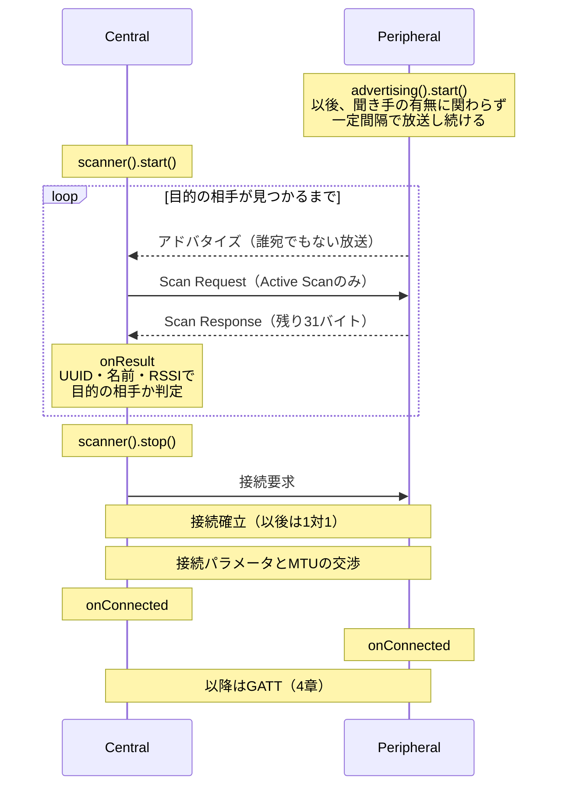
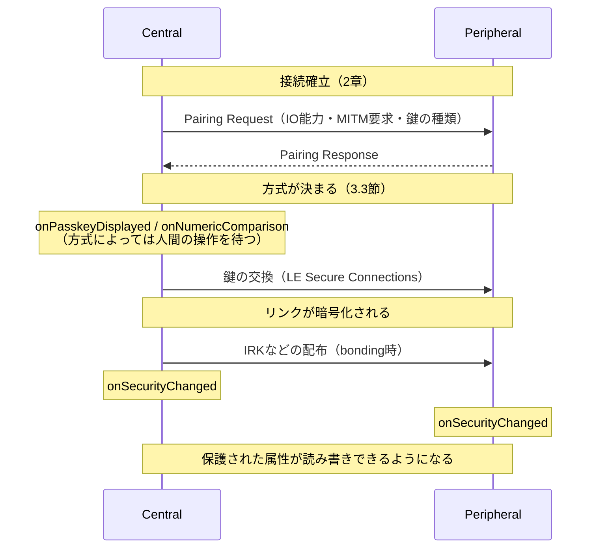
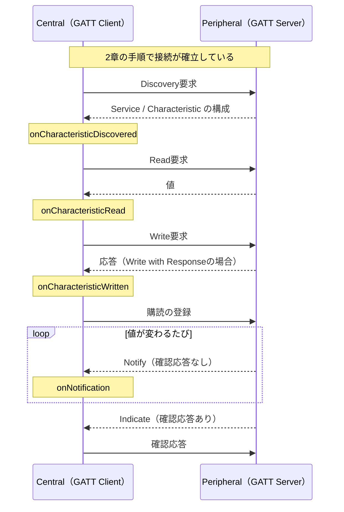

# BLE通信の入門ガイド

BLEを初めて使う人が、**何が起きているのか**を理解するための資料です。用語はすべてこの文書内で説明します。

実際のコードは各exampleにあります。この文書は概念に集中し、対応するexampleへのリンクを示します。

---

## 1. BLEとは

Bluetooth Low Energy（BLE）は、**小さなデータを低消費電力でやり取りする**ための無線規格です。

名前は似ていますが、イヤホンやSPP（Serial Port Profile）で使われてきた**Bluetooth Classicとは別物**で、互換性はありません。

| | Bluetooth Classic | BLE |
|---|---|---|
| 通信の形 | 常時接続のストリーム | 必要なときだけ短くやり取りするイベント指向 |
| 向いているもの | 音声（A2DP/HFP）、シリアル（SPP） | センサー値、キー入力、設定値 |
| 消費電力 | 大きい | ボタン電池で年単位を狙える |

EspBleはBLE専用です。ESP32-S3などの対象チップはBluetooth Classicを搭載しておらず、A2DP・HFP・SPPは使えません。「BLEでシリアル通信のようなことをしたい」場合は、後述するGATTの上に構築します。

### 1.1 GAPとGATT — 2つの層

BLEを理解する最初の鍵は、**GAPとGATTという2つの層がまったく別の仕事をしている**ことです。

| | GAP（Generic Access Profile） | GATT（Generic Attribute Profile） |
|---|---|---|
| 担当 | **探す・つながる** | **やり取りする** |
| 扱うもの | アドバタイズ、スキャン、接続、アドレス | Service、Characteristic、値の読み書き |
| いつ使うか | 接続が成立するまで | 接続が成立した後 |

一言でいえば、**探して繋ぐまでがGAP、繋がった後の会話がGATT**です。この文書は2章でGAP、4章でGATTを扱い、その間の3章でリンクの保護（セキュリティ）を扱います。

### 1.2 4つの役割 — 2つの独立した軸

BLEには役割を表す言葉が4つ出てきます。混乱しやすいのは、これが**独立した2つの軸**だからです。

**軸1: リンクの役割（GAPの話）**

- **Peripheral（周辺機器）** — アドバタイズして待つ側。接続を**受け入れる**
- **Central（親機）** — スキャンして探す側。接続を**開始する**

**軸2: データの役割（GATTの話）**

- **GATT Server** — 値を**持っている**側。読み書きに応え、変化を通知する
- **GATT Client** — 値を**使う**側。読み書きを要求し、通知を購読する

典型的には「Peripheral = GATT Server」「Central = GATT Client」ですが、**これは決まりではありません**。接続が確立した後は、どちらの側もServerにもClientにもなれます。たとえばキーボード（Peripheral）がホストの時刻を読みに行けば、それはPeripheralかつGATT Clientです。

ESP32は1台で**CentralとPeripheralを同時に**こなせます。たとえばキーボードから入力を受け取りつつ（Central）、PCへキーボードとして見せる（Peripheral）といった構成が可能です。

### 1.3 大原則 — 要求とイベントは別のタイミング

EspBleのAPIを読む前に、必ず知っておくべき約束事です。

BLEの操作はほぼすべて**非同期**です。「接続して」と頼んでもその場では接続しません。無線のやり取りが終わるのは、早くて数十ミリ秒後、遅ければ数十秒後です。

そこでEspBleは操作を2段階に分けています。

1. **要求API** — 「お願いを受け付けたか」だけをその場で `bool` で返します。まだ何も完了していません
2. **イベント** — 実際の完了・失敗は、後から登録済みのコールバックへ届きます

そして**すべてのイベントは `loop()` の中で呼ぶ `ble.update()` から配送されます**。

```cpp
void loop() {
  ble.update();  // ここで初めて、溜まっていたイベントがコールバックへ配送される
  delay(1);
}
```

これは意図的な設計です。BLEスタックは専用のタスクで動いており、そこから直接コールバックを呼ぶと、アプリケーションのコードが別スレッドで動くことになります。EspBleはイベントを一度キューに溜め、`update()` を呼んだタスク（通常は `loop()`）でのみ配送します。**コールバックの中で共有変数を触っても排他制御が要らない**のはこのためです。

裏を返せば、**`update()` を呼び忘れると何も起きません**。スキャン結果も接続完了も届かず、原因の分かりにくい「動かない」状態になります。

この非同期の性質から、EspBleのコードは自然と**連鎖（チェーン）**の形になります。「操作を頼む → その完了イベントの中で次を頼む」の繰り返しです。

---

## 2. GAP編 — 探してつながる

この章はBLE通信の時系列に沿って進みます。**アドバタイズ（Peripheral）→ スキャン（Central）→ 接続（両者）**の順です。

### 2.1 アドバタイズ — Peripheralが存在を知らせる

すべての始まりはPeripheral側の**アドバタイズ**（advertising、広告）です。

アドバタイズとは、**「ここにいます、こういう機器です」という短いデータを周囲へ一定間隔で放送し続ける**ことです。宛先はありません。電波の届く範囲にいる全員が受信できます。

#### 何を載せられるか

アドバタイズのデータは**AD構造**（AD structure）の並びです。それぞれが「長さ・種別・値」の3要素を持ちます。主な種別は次のとおりです。

| 載せるもの | 用途 |
|---|---|
| **Flags** | 「接続可能か」「Classic非対応か」などの基本属性。EspBleが自動で付けます |
| **Local Name** | 人間が読む名前。`EspBle Keyboard` など |
| **Service UUID** | 提供する機能の種別。受信側が絞り込みに使う最も重要な情報 |
| **Service Data** | Service UUIDと組にした値そのもの。センサーが値を放送するときに使う |
| **Manufacturer Data** | ベンダー独自のデータ。iBeaconもこの形式 |
| **Appearance** | 機器の見た目の種別（キーボード、体温計など）。スマホがアイコン表示に使う |
| **Tx Power Level** | 送信電力。受信側がRSSIと組み合わせて距離を推定できる |

#### 31バイトの壁

ここが最初の関門です。**アドバタイズのデータは31バイトしか入りません。**

しかも各AD構造は値のほかに2バイト（長さ＋種別）を消費します。128ビットのService UUIDを1つ載せるだけで、16 + 2 = 18バイト。Flagsの3バイトと合わせると、残りは10バイトしかありません。

この制限を緩める仕組みが**Scan Response**です。受信側が「もっと教えて」と要求すると、Peripheralは**もう1つの31バイト**を返せます。合計62バイトです。

- **アドバタイズ本体** — 近くの全員に届く。相手を判別するための最小限を置く
- **Scan Response** — 要求してきた相手にだけ届く。名前などかさばる情報を置く

EspBleは、Scan Responseに何も指定しなければ**デバイス名を自動的にそちらへ置きます**。31バイトを名前で消費しないためです。どちらの面に何を載せるかを自分で決めるときは、`advertising().data()` と `advertising().scanResponse()` がそれぞれの面のビルダーを返します。

> **なぜ31バイトなのか、増やせないのか**
> これはBLE 4.0からある**Legacy Advertising**の仕様上の上限です。BLE 5.0の**Extended Advertising**を使えば255バイトまで拡張できますが、EspBleでは利用できません。Arduino-ESP32に同梱されているNimBLEが `CONFIG_BT_NIMBLE_EXT_ADV` を無効にしてビルドされており、Arduinoライブラリ側からこの設定を変更する手段がないためです。

#### 接続できるアドバタイズ、できないアドバタイズ

アドバタイズには2種類あります。

- **Connectable** — 「接続していいですよ」という放送。通常のPeripheral（既定）
- **Non-connectable** — 放送するだけで接続は受け付けない。**ビーコン**と呼ばれる形態。`advertising().setConnectable(false)` で切り替える

ビーコンは、値そのものをアドバタイズに載せてしまい、接続という手続きを省きます。温度センサーが5秒ごとに温度を放送する、店舗の棚が識別子を放送する、といった用途です。受信側は接続しないので、**1つのビーコンを何台でも同時に受信できる**という利点もあります。

#### アドバタイズ間隔

放送の間隔は `advertising().setInterval(minMs, maxMs)` で20ミリ秒から10.24秒まで設定できます。トレードオフは明快です。

- **短い** — すぐ見つけてもらえるが、電力を消費する
- **長い** — 電池は持つが、相手が見つけるまで時間がかかる

なお仕様上、Non-connectableなアドバタイズは**100ミリ秒以上**にする必要があります。

#### 相手を1台に限定する（Directed Advertising）

通常のアドバタイズが「誰でもどうぞ」と放送するのに対し、**Directed Advertising**は**送信先のアドレスを指定**し、その相手だけが接続できます。`advertising().setDirectedTarget(address, addressType)` で指定し、`clearDirectedTarget()` で通常のアドバタイズに戻ります。

主な用途は、ボンディング済みの相手への素早い再接続です。第3引数に `true` を渡す**High Duty Cycle**では3.75ミリ秒間隔で最大1.28秒間送出し、極めて短時間で再接続を成立させます（1.28秒で自動的に止まります）。`false`（既定）なら通常の間隔で、止めるまで続きます。

制約が2つあります。

- **ペイロードを一切載せられません**。これは仕様上の制約で、有向アドバタイズは2つのアドレスだけを運びます。名前もService UUIDも送られないので、相手は「スキャンで見つけて接続する」のではなく**アドレスを指定して接続する**ことになります
- 相手がRPA（2.4節）を使っている場合、その場のアドレスではなく**識別用アドレス**を指定します。解決はボンド情報を使って行われるため、**先にボンディングが必要**です

受信側では、自分宛のDirected Advertisingだけがスキャン結果に届きます（他人宛のものはコントローラが破棄します）。届いた結果はアドレス・アドレス種別・RSSIだけを持ち、接続可能フラグは立ち、スキャン応答可能フラグは立ちません。そのまま通常どおり接続できます。ただし**「これはDirected Advertisingだ」と判別する手段はありません**。EspBleがアドバタイズ種別を公開していないためで、「接続可能・スキャン応答不可・データが空」という組み合わせから推測することになります。

#### アドバタイズチャネルの選択

アドバタイズは3つのチャネル（37・38・39）を使います。`advertising().setChannelMap(mask)` で使うチャネルを絞れます。maskは `EspBleAdvertisingChannel37` / `38` / `39` のビットマスクで、0を渡すと3チャネルすべてに戻ります。

Wi-Fiの混んでいる帯域と重なるチャネルを外す、といった用途です。ただしチャネルを減らすと**相手に見つけてもらえるまでの時間は延びます**。

#### 関連するexample

| example | 内容 |
|---|---|
| [Gap/Advertise](../examples/Gap/Advertise/) | 名前とService UUIDを載せた最小のアドバタイズ |
| [Gap/ScanResponse](../examples/Gap/ScanResponse/) | 2面に分けて31バイト制限を回避する |
| [Gap/Beacon](../examples/Gap/Beacon/) | Manufacturer Dataを載せた接続不可のビーコン |
| [Gap/IBeacon](../examples/Gap/IBeacon/) | Appleが定めたiBeaconレイアウト |
| [Gap/ServiceData](../examples/Gap/ServiceData/) | Service Dataとしてセンサー値を放送する |
| [Gap/DirectedAdvertise](../examples/Gap/DirectedAdvertise/) | 相手を1台に指定して放送する（ペイロードは載らない） |

### 2.2 スキャン — Centralが相手を探す

Central側は**スキャン**（scanning）で周囲のアドバタイズを受信します。

#### passiveとactive

スキャンには2種類あり、`scanner().start()` へ渡す `EspBleScanConfig` の `active` で選びます。

| | `active` | 動作 | 受け取れるもの |
|---|---|---|---|
| **Active Scan** | `true`（既定） | アドバタイズを受信したら**Scan Request**を送り返す | アドバタイズ本体＋**Scan Response** |
| **Passive Scan** | `false` | ただ聞くだけ。こちらは何も送信しない | アドバタイズ本体のみ |

前節のとおり名前はScan Responseに置かれることが多いため、**名前で相手を探すならActive Scanが必要**です。既定が `true` なのはこのためです。

Passive Scanの利点は、こちらが電波を出さないことです。消費電力が下がり、周囲に自分の存在を知られません。相手を判別するのにService UUIDだけで足りるなら、Passiveで十分です。

#### intervalとwindow

同じく `EspBleScanConfig` に、スキャンの時間を決める設定が2つあります。

- **interval（間隔）** — スキャンを開始する周期。`intervalMilliseconds`
- **window（窓）** — そのうち実際に受信している時間。`windowMilliseconds`

たとえばinterval 100ミリ秒・window 50ミリ秒なら、**受信しているのは半分の時間**です。残り半分は他の処理に使えます。window = intervalにすれば常時受信になりますが、消費電力は最大になります。

スキャンを続ける時間は `durationSeconds` で指定し、`0` なら止めるまで続きます。

#### 特定の相手だけを受け取る

Filter Accept Listは、アドバタイズ側（誰の接続を受けるか、2.3節）だけでなく**スキャン側**にも効きます。`EspBleScanConfig::acceptListOnly` を `true` にすると、許可リストに載っていない相手のアドバタイズはコントローラが捨て、`onResult` まで届きません。

受け取ってからアプリケーションで判定するのに比べ、無駄な処理が起きない点が違います。照合はアドレス単位なので、RPAを回転させる相手はbondingしてidentity addressが使えるようになるまで意味のある登録ができません。

#### 見落としの問題

ここが実務で最も引っかかる点です。

アドバタイズは一瞬の放送であり、スキャン側のwindowが閉じている間に飛んできたものは**受信できません**。さらにBLEは3つのチャネルを順に使うため、タイミングによってはさらに取りこぼします。

したがって、**1回スキャンして見つからなくても「その機器が存在しない」とは言えません**。実用的には次のようにします。

- 通常は**3〜5秒**のスキャンを行う
- 周囲にBLE機器が多い環境では、さらに長く取る
- 特定の相手を待つなら、時間無制限で見つかるまでスキャンし続ける

#### 受信結果に何が入るか

1件のスキャン結果（`EspBleScanResult`）には、アドバタイズ（とActive Scanなら Scan Response）から取り出した情報が入ります。`address` / `addressType` / `rssi`（受信強度）/ `connectable` / `name` / `serviceUuids` / `serviceData` / `manufacturerData` です。

目的のService UUIDを持つ相手かどうかは `advertisesService(uuid)` で判定します。UUIDを値として比較するため、短縮形とフル形のどちらで書いても一致します。

RSSIはdBmで、0に近いほど近くにあります。目安として-40は至近、-90はかなり遠い、という感覚です。

#### 重複除外という落とし穴

同じ機器のアドバタイズは繰り返し飛んできます。EspBleは既定で**重複を除外**し、1つの機器につき1回だけ通知します。周囲の機器を一覧するだけならこのほうが扱いやすいためです。

ここに落とし穴があります。**payloadが変化し続ける機器では、最初の値しか届きません。** 温度を5秒ごとに更新して放送するセンサービーコンでも、受け取れるのは1回目だけで、以降の更新は「送られてこない」ように見えます。送信側は正常に放送しているので、原因に気づきにくい部類の問題です。

ビーコンの値を追いたいときは、`scanner().start()` へ渡す `EspBleScanConfig` の `wantDuplicates` を `true` にします。この設定はスキャン開始時に反映されるため、動作中に変える場合はスキャンを止めて開始し直してください。

代償は通知の量です。周囲の全機器の全アドバタイズが届くようになるため、処理が追いつかないと取りこぼしが発生します。目的の機器が決まっているなら、絞り込みを先に行ってください。

AppearanceとTx Power Levelも、載っていれば `appearance` と `txPowerLevel`（`hasTxPowerLevel()` で有無を判定）で取り出せます。Tx Powerは特に有用で、**申告された送信電力とRSSIの差が経路損失**になり、距離推定の基礎になります。RSSIだけでは「もともと弱く送っている近くの機器」と「強く送っている遠くの機器」を区別できません。

1件のアドバタイズにService Dataが複数載っていることもあります。その場合は順序に頼らず、`serviceDataFor(uuid, data)` でUUIDを指定して目的のブロックを取り出してください。UUIDは値として比較されるため、16ビットの短縮形で書いても一致します。

#### 関連するexample

| example | 内容 |
|---|---|
| [Gap/Scan](../examples/Gap/Scan/) | アドレス・RSSI・名前を表示する最小のスキャン |
| [Info/ScanDump](../examples/Info/ScanDump/) | 取り出せる全フィールドの表示とiBeaconのデコード |
| [Gap/AcceptList](../examples/Gap/AcceptList/) | 同じ許可リストを接続制限とスキャンの絞り込みの両方に使う |

接続の必要がない用途——ビーコンの受信——は、ここで完結します。

### 2.3 接続 — 1対1の関係を作る

目的の相手が見つかったら**接続**します。接続を開始できるのはCentral側だけです。

#### 接続する前に判断する

見つかった端末すべてに接続してはいけません。BLEの同時接続数には上限があり（EspBleが使う同梱NimBLEのビルドではESP32-S3で3接続）、無駄な接続は資源を奪います。

スキャン結果には判断材料が揃っています。

- **Service UUID** — 目的の機能を持っているか。最も確実な判定基準
- **名前** — 人間が識別しやすい。ただし同名の機器がありうる
- **接続可能フラグ** — ビーコンには接続できない
- **アドレス** — 特定の1台だけを狙う場合
- **RSSI** — 「十分近いものだけ」という条件を付けたい場合

複数を組み合わせるのが実用的です。「このService UUIDを持ち、かつRSSIが-70より強いもの」といった具合です。

#### Peripheral側は接続を拒否できるか

**アプリケーションのコードでは拒否できません。**

BLEには「接続要求が来ました、承認しますか？」という問い合わせの仕組みがありません。接続の可否はコントローラ（無線チップ側）が判断し、アプリケーションが知るのは接続が成立した後です。

制限したい場合の手段は3つあります。

| 手段 | 効果 | 使うAPI |
|---|---|---|
| **Filter Accept List** | 許可リストに載っていない相手の接続要求をコントローラが黙って捨てる。最も確実 | `addToAcceptList()` ＋ `advertising().setFilterPolicy()` |
| **接続後に切断する** | 相手を見て切断する。一度は接続が成立してしまう | `onConnected()` の中で `disconnect()` |
| **属性を暗号化で守る** | 接続は許すが、値の読み書きにペアリングを要求する（3章） | Characteristicの `encryptedRead` / `encryptedWrite` |

なお拒否された相手に「拒否された」とは伝わりません。Link Layerに拒否を返すPDUが存在せず、要求が無視されるだけだからです。相手側からは応答のないタイムアウトに見えます。

#### 接続が成立したら

接続すると、以降のやり取りは**その1対1のリンクの中だけ**で行われます。アドバタイズのように周囲へ漏れることはありません。

接続には次のパラメータがあり、通信の応答性と消費電力を決めます。

- **Connection Interval** — 通信機会の周期。短いほど応答が速く、電力を食う
- **Peripheral Latency** — Peripheralが応答をスキップしてよい回数。送るものがないときに電力を節約する
- **Supervision Timeout** — この時間だけ通信が途絶えたら切断とみなす

現在の値は接続情報（`EspBleConnection`）の `connectionInterval` / `peripheralLatency` / `supervisionTimeout` で読めます。変更については2.7節を参照してください。

もう1つ重要なのが**MTU**（Maximum Transmission Unit）です。1回のやり取りで運べるバイト数の上限で、接続時に両者が希望値を交換し、**小さい方**が採用されます。

MTUの仕様上の最小値は23バイトです。このうち3バイトはプロトコルのヘッダが使うため、実際に運べるのは**20バイト**しかありません。EspBleの既定値は247で、244バイトまで1回で送れます。これを超えるデータは分割が必要になります。

交渉結果は `EspBleConnection::mtu`、1回で送れる実バイト数は `maximumNotificationPayload()` で確認できます。

接続が切れると切断イベントが届き、その中で切断理由のコードが分かります。自分から切ったのか、相手が切ったのか、電波が届かなくなった（Supervision Timeout）のかを区別できます。自分から切断するときに相手へ伝える理由コードを `disconnect(id, reason)` の第2引数で指定することもでき、その値がそのまま相手の `disconnectReason` に現れます。

#### 関連するexample

| example | 内容 |
|---|---|
| [Gap/Connect](../examples/Gap/Connect/) | Service UUIDで絞り込んで接続し、接続・切断・失敗を受け取る |
| [Gap/AcceptList](../examples/Gap/AcceptList/) | Filter Accept Listで接続できる相手を制限する（スキャン側の絞り込みも同じリスト） |
| [Gap/Mtu](../examples/Gap/Mtu/) | MTUの交換と、1回で送れるサイズの確認 |
| [Info/ConnectionInspector](../examples/Info/ConnectionInspector/) | 接続パラメータやPHYの観察 |

### 2.4 アドレスとプライバシー

アドバタイズには必ず送信元の**アドレス**（6バイト）が載ります。ここに問題があります。

工場出荷時のアドレス（**Public Address**）をそのまま使うと、**その値が変わらないため、周囲の誰でもあなたの機器を追跡できます**。持ち歩く機器では現実的な問題です。

BLEはこれに対して3種類のアドレスを用意しています。

| 種別 | 性質 | 追跡耐性 |
|---|---|---|
| **Public** | 工場出荷の固定値 | なし |
| **Random Static** | 起動時に生成する固定のランダム値 | 出荷アドレスは隠せるが、値自体で追跡できる |
| **Resolvable Private Address（RPA）** | コントローラが定期的に変える | 高い |

RPAは一定時間ごとにアドレスを変えるので、外から見ると別の機器になります。しかしそれでは**正規の相手も見失ってしまいます**。

これを解決するのが**ボンディング**（bonding）です。ペアリングで作った鍵を保存しておく仕組みで、詳しくは3.2節で扱います。このとき**IRK**（Identity Resolving Key）という鍵も交換され、相手はその鍵でRPAを計算し、「これはあのときの機器だ」と復元できます。鍵を持たない第三者には、ただの変化するアドレスにしか見えません。

つまり**RPAはボンディングとセットでのみ意味を持ちます**。ボンディングなしでRPAを使うと、相手は再接続できなくなります。

ボンディング済みの相手を指す不変のアドレスを**Identity Address**と呼びます。Filter Accept Listがアドレスで照合する以上、RPAを使う相手を許可リストに載せられるのは、ボンディングしてIdentity Addressが効くようになってからです。

> **RPAの変更周期は変えられません**
> 同梱NimBLEのビルド設定（`CONFIG_BT_NIMBLE_RPA_TIMEOUT`、900秒）で固定されており、アプリケーションから変更する手段がありません。

自分が今どのアドレスを使っているかは `localAddress()` で取得できます（種別は `localAddressType()`）。相手のFilter Accept Listへ登録してもらう際に必要になる値で、RPAを使っている場合はコントローラが回転させるたびに変わります。

関連するexample: [Gap/PrivateAddress](../examples/Gap/PrivateAddress/)

### 2.5 初期化時に決めること

GAPの締めくくりとして、通信を始める前に決めておく設定をまとめます。これらは初期化時に指定し、以降の通信全体に影響します。

いずれも `EspBleConfig` に指定して `begin()` へ渡します。

| 設定 | 内容 | フィールド |
|---|---|---|
| **デバイス名** | アドバタイズや接続後に相手へ見せる名前 | `deviceName` |
| **希望MTU** | 1回で運べるサイズ。既定247。大きいほど効率的だが、接続ごとにメモリを使う | `preferredMtu` |
| **自分のアドレス種別** | Public / Random Static / RPA（2.4節） | `ownAddressType` |
| **セキュリティ** | ペアリング・ボンディングの有効化と、認証方式 | `security` |

MTUを下げる理由があるとすれば、多数の同時接続でメモリを節約したい場合です。逆に既定の247で困ることは通常ありません。

**MTUが決まるのは接続が成立した「後」です。** 交換は接続直後に行われるため、`onConnected` の時点では両者ともまだ既定の23で、交渉結果は `onMtuChanged` で届きます。CentralとPeripheralのどちらも同じ順序です。接続直後に大きなデータを送る処理を書くときは、`onConnected` ではなく `onMtuChanged` を待ってください。

**送信電力**は `setTxPower(dBm)` で変更でき、実際に適用された値は `txPower()` で読めます。上げれば距離が伸び、下げれば消費電流が減ります。無線が対応するのは飛び飛びの値（同梱ビルドでは-12〜+9 dBmの3 dB刻み）で、指定した値に最も近いものが適用されます。これは初期化時に限らずいつでも変更でき、アドバタイズ・スキャン・接続のすべてに効きます。アドバタイズにTx Power Levelを載せている場合、その値も追従します。

セキュリティ（`security`）は指定できる項目が多いため、次の3章でまとめて扱います。

関連するexample: [Gap/Mtu](../examples/Gap/Mtu/)

### 2.6 時系列で見る全体像（GAP）

アドバタイズから接続確立までを1本の流れにすると次のようになります。Scan Requestは**Active Scanのときだけ**送られます。



接続の必要がないビーコン用途では、`onResult` までで完結します。

### 2.7 GAPで対応していないこと

BLEの仕様にはあるが、EspBleでは使えない機能です。理由もあわせて挙げます。

#### Extended Advertising / Periodic Advertising

BLE 5.0で追加された、255バイトまでのペイロードを扱う仕組み（Extended）と、接続せずに定期的なデータ配信を受ける仕組み（Periodic）です。

**使えません。** 同梱NimBLEが `CONFIG_BT_NIMBLE_EXT_ADV` を無効にしてビルドされており、Arduinoライブラリ側からこの設定を変更する手段がないためです。Periodic AdvertisingはExtended Advertisingの上に成り立つ仕組みなので、同じ理由で使えません。

結果として、アドバタイズは31バイト × 2面（本体とScan Response）が上限になります。

#### 接続時のパラメータ指定

接続を開始する時点でConnection IntervalやPHYを指定することは**できません**。同梱backendの接続APIが指定を受け付けないためです。

ただしこれは実用上の障害にはなりません。**接続はコントローラが決めた値で成立し、そのあとで変更を要求できます**。パラメータは `updateConnectionParameters()`、PHYは `updatePhy()` で要求し、結果はそれぞれ `onConnectionParametersUpdated()` と `onPhyUpdated()` に届きます。要求も結果の受け取りも、どちらの役割からでも行えます。手順は[Gap/ConnectionParameters](../examples/Gap/ConnectionParameters/)を参照してください。

---

## 3. セキュリティ編 — つながった相手をどこまで信頼するか

接続しただけでは、相手が誰なのかも、やり取りが盗み見られていないかも分かりません。それを決めるのがこの章です。

BLEでは**GAP・GATTと並ぶ独立した層**として**SMP**（Security Manager Protocol）がこれを担当します。GAPが「つながる」、SMPが「どこまで信頼するかを決める」、GATTが「その信頼を属性ごとに要求する」という分担です。この章はリンク単位の方針を扱い、属性ごとの要求は4章で扱います。

### 3.1 何から守るのか

「セキュリティを有効にする」と一括りにされがちですが、守る対象は3つあり、**それぞれ対策が違います**。

| 脅威 | 内容 | 対策 |
|---|---|---|
| **盗聴** | 電波を傍受して中身を読まれる | **暗号化**。ペアリングすれば得られる |
| **なりすまし（MITM）** | 通信の間に割り込み、両者になりすます | **認証つきペアリング**。passkeyなどで「同じ相手を見ている」ことを確かめる |
| **追跡** | 変わらないアドレスから個体を追われる | **RPA**（2.4節）。ボンディングとセットで使う |

重要なのは、**暗号化されていても、なりすましは防げない**ことです。passkeyを使わないペアリング（Just Works）は、鍵交換の相手が本物かを確かめる手段を持ちません。中間者が両側とそれぞれペアリングしてしまえば、両方の通信は正しく暗号化されたまま素通しされます。

EspBleではこの区別が結果にそのまま現れます。`onSecurityChanged` で届く接続情報の `encrypted` が盗聴対策、`authenticated` がなりすまし対策です。Just Worksでは `encrypted=1, authenticated=0` になります。

### 3.2 ペアリングとボンディング

この2つは混同されがちですが、別のものです。

- **ペアリング**（pairing） — その場で鍵を作り、リンクを暗号化する手続き。切断すれば鍵は消える
- **ボンディング**（bonding） — ペアリングで作った鍵を**両者が保存**し、次の接続で再利用できるようにすること

ボンディングすると、2回目以降は鍵交換をやり直しません。接続してすぐ、保存済みの鍵で暗号化が始まります。passkeyの入力も一度きりで済みます。**「一度ペアリングしたら次からは何もしなくていい」という体験は、ボンディングがあって初めて成立します。**

保存されるのは暗号鍵だけではありません。**IRK**（Identity Resolving Key）も交換され、これがRPAの解決に使われます（2.4節）。RPAがボンディングとセットでしか意味を持たないのはこのためです。

ボンド情報は電源を切っても残ります（NVSに保存されます）。したがって**消す手段が必要**で、`deleteBond()` / `deleteAllBonds()` がそれにあたります。相手側だけがボンドを消した状態で再接続すると、鍵の食い違いでペアリングがやり直しになるか、失敗します。片側だけ消さないでください。

### 3.3 ペアリング方式はIO能力で決まる

どの方式でペアリングするかを**アプリケーションが直接指定することはできません**。両者が「自分は何を表示できて、何を入力できるか」（**IO能力**）と「MITM保護が要るか」を申告し、その組み合わせから方式が**自動的に決まります**。

| 方式 | 成立条件 | ユーザー操作 | `authenticated` |
|---|---|---|---|
| **Just Works** | どちらかがMITMを要求しない、または一方のIO能力が `None` | なし | 0 |
| **Passkey Entry** | 片方が表示（`DisplayOnly`）、もう片方が入力（`KeyboardOnly`） | 6桁の数字を表示 → もう一方が入力 | 1 |
| **Numeric Comparison** | 両方が `DisplayYesNo` かつMITM要求 | 両方に同じ6桁が出る → 一致を確認 | 1 |

ここから導かれる実用上の結論があります。**ボタンも画面も無い機器は、原理的にMITM保護を得られません。** 入力も表示もできない以上、人間が「同じ相手を見ている」ことを確かめる手段が無いからです。IO能力を偽って `DisplayOnly` を申告しても、表示できないpasskeyを相手が入力できないので、ペアリングは失敗するだけです。

もう1つの注意点として、**Numeric Comparisonは両方がLE Secure Connectionsに対応している場合にのみ使えます**。EspBleは常にLE Secure Connectionsで動作するため、相手がBLE 4.2より古い場合は選ばれません。

### 3.4 いつ暗号化が始まるか

タイミングは3通りあり、どれを使うかで設計が変わります。

**1. 接続と同時に開始する（`pairOnConnect`）**

接続が成立したらすぐペアリングを始めます。以降のやり取りはすべて暗号化された状態で行われるため、一番分かりやすい形です。EspBleの既定です。

**2. アプリケーションが明示的に開始する（`requestSecurity()`）**

条件を見てから暗号化したい場合に使います。Central側から呼びます。

**3. 保護された属性に触れた瞬間に開始する**

Characteristicに `encryptedRead` などを付けておくと、暗号化されていないリンクからの読み書きはATT層でエラー（insufficient encryption）になります。多くのOSはこのエラーを受けて**自動的にペアリングを始めます**。「必要になったときだけ認証を求める」形はこれで実現できます。

いずれの場合も、結果は `onSecurityChanged` に届きます。**このコールバックが来るまで、保護された属性は読めません。** 接続直後にReadを投げる作りにすると、1と3のどちらでも競合します。



### 3.5 EspBleでの設定

方針は `EspBleConfig::security` にまとめて指定し、`begin()` へ渡します。**接続ごとに変えることはできません。**

| フィールド | 既定 | 内容 |
|---|---|---|
| `enabled` | `false` | セキュリティ機能全体の有効化。これが `false` なら他の設定は指定できない |
| `bonding` | `true` | 鍵を保存して次回に備えるか（3.2節） |
| `pairOnConnect` | `true` | 接続と同時にペアリングを開始するか（3.4節の1） |
| `mitm` | `false` | なりすまし対策を要求するか。`true` にはIO能力が必要 |
| `ioCapability` | `None` | `None` / `DisplayOnly` / `KeyboardOnly` / `DisplayYesNo`（3.3節） |
| `staticPasskeyEnabled`／`staticPasskey` | `false`／`0` | passkeyを実行時に扱わず固定値にする |

矛盾した組み合わせは `begin()` が `InvalidArgument` で弾きます。「`enabled=false` なのにMITMを指定した」「MITMなのにIO能力が `None`」「MITMでないのにpasskeyを指定した」などです。**黙って無視して弱い設定で動き出すことはありません。**

固定passkeyは配線が単純ですが、**値がスケッチに焼き込まれる以上、秘密にはなりません**。ソースを読める相手には無防備です。実運用では実行時に決める方（`onPasskeyDisplayed` で表示された値を人間が伝える）を選んでください。

対応するコールバックとAPIは次のとおりです。

| API | 役割 |
|---|---|
| `onSecurityChanged(cb)` | ペアリングの成否と、その結果のセキュリティ状態 |
| `onPasskeyDisplayed(cb)` | 自分が表示側のとき、表示すべき6桁が届く |
| `onNumericComparison(cb)` ＋ `confirmNumericComparison(bool)` | 両方に出た6桁の一致を人間が確認して答える |
| `providePasskey(uint32_t)` | 自分が入力側（`KeyboardOnly`）のとき、受け取った6桁を渡す |
| `requestSecurity(id)` | ペアリングを明示的に開始する（3.4節の2） |
| `bondCount()` / `bond(i, out)` / `deleteBond()` / `deleteAllBonds()` | 保存済みボンドの列挙と削除 |

ボンドを削除するときは**すべて切断してから**行ってください。使用中のボンドを消すと、リンクの鍵と保存内容が食い違います。

### 3.6 制限

理由とあわせて挙げます。

- **保存できるボンドは3件まで** — 同梱NimBLEが `CONFIG_BT_NIMBLE_MAX_BONDS=3` でビルドされており、Arduinoライブラリ側から変更する手段がありません。4台目とボンディングすると古いものが押し出されます。多数の相手を覚える用途には向きません
- **passkeyの応答中、BLEホストは停止します** — passkeyの入力（`providePasskey`）とNumeric Comparisonの確認（`confirmNumericComparison`）は、SMPが答えを待つ間ホストタスクを止めます。仕様上ペアリングは応答を待って進む手続きで、途中で他の処理を挟めないためです。**30秒で打ち切り、ペアリングは失敗します**。`loop()` の中で長く待たせる作りにしないでください
- **OOB（Out Of Band）ペアリングは使えません** — NFCなど別経路で鍵を渡す方式です。渡す経路そのものがESP32側に無いため対応していません
- **署名付き書き込み（CSRK）は使えません** — 暗号化せず署名だけで完全性を守る仕組みです。交換する鍵を暗号鍵とIRKに限っており、実運用でこれを使う機器がほぼ存在しないためです
- **ペアリング方式を直接指定することはできません** — 3.3節のとおり仕様がIO能力から導出するもので、BLEにそのようなAPIがありません

### 3.7 関連するexample

| example | 内容 |
|---|---|
| [Security/JustWorksServer](../examples/Security/JustWorksServer/) | 暗号化を要求するCharacteristicと、Just Works＋ボンディング |
| [Security/StaticPasskeyServer](../examples/Security/StaticPasskeyServer/) | 表示側（`DisplayOnly`）。MITM認証つきペアリング |
| [Security/StaticPasskeyClient](../examples/Security/StaticPasskeyClient/) | 入力側（`KeyboardOnly`）。認証後に保護された値を読む |
| [Security/RuntimePasskeyServer](../examples/Security/RuntimePasskeyServer/) | passkeyをPairingごとに生成して表示する（固定値を使わない形） |
| [Security/RuntimePasskeyClient](../examples/Security/RuntimePasskeyClient/) | 表示された値を実行時に `providePasskey()` で渡す |
| [Security/NumericComparisonServer](../examples/Security/NumericComparisonServer/) | 両側に出た6桁の一致を確認する（Peripheral側） |
| [Security/NumericComparisonClient](../examples/Security/NumericComparisonClient/) | 同上のCentral側 |

---

## 4. GATT編 — データをやり取りする

接続が成立したら、ここからはGATTの領域です。

### 4.1 GATTの構造

GATTでは、データが3階層で表現されます。

- **Service** — 機能のまとまり。「電池」「心拍計」など
- **Characteristic** — 個々の値。「電池残量」「心拍数」など。Serviceの中に複数入る
- **Descriptor** — Characteristicに付随する補足情報。単位や説明、通知の有効・無効の設定など

それぞれがUUIDという識別子を持ちます（5章で詳しく説明します）。

ただし**UUIDは「型」であって「どれか」ではありません。** 仕様上、同じUUIDのServiceやCharacteristicを1台が複数持てます。HIDキーボードが複数のReport Characteristicを同じUUIDで並べるのが典型例です。

そのためEspBleでは、**登録時に返るハンドルで対象を指定します**。`addService()` がServiceのハンドルを返し、それを `addCharacteristic()` へ渡すとCharacteristicのハンドルが返り、以降の値設定やNotifyはそのハンドルで行います。イベント（書き込み通知や購読状態の変化）にも対象のハンドルが入るので、UUIDが同じでもどれのことか分かります。

Client側は、相手のCharacteristicを**属性ハンドル**で指定できます。同じUUIDのCharacteristicが並ぶHIDのReportを撃ち分けるのはこの方法です。

#### 同一UUIDの重複はどこまで扱えるか

仕様が認めている重複は、**どちらの役割でも扱えます**。

| | 同じUUIDの**Service**を複数持つ | 同じServiceの中に同じUUIDの**Characteristic**を複数持つ |
|---|---|---|
| **Peripheral（公開する側）** | できる | できる |
| **Central（読む側）** | 区別できる（属性ハンドルで指定） | 区別できる（属性ハンドルで指定） |

Peripheral側は、`addService()` / `addCharacteristic()` が返すハンドルが対象を表します。EspBleはBLEスタックのAPI（`ble_gatts_add_svcs()`）で属性テーブルを直接組み立て、読み書きの通知もスタックが渡す「どの定義か」の情報で判別するので、UUIDが同じでも取り違えません。

Central側は、相手がどう重複させていても属性ハンドルで撃ち分けられます。discoveryを`ble_gattc_disc_all_svcs()`などのAPIで自前に行い、read / write / 購読（CCCDへの書き込み）もすべて属性ハンドルに対して直接発行するためです。Notificationも、どのハンドルから来たかで対応付けます。

ひとつだけ制限があります。**再接続時の購読自動復元は、UUIDが一意なCharacteristicに限られます。** 復元は相手のアドレスとUUIDを手掛かりに行うため、同じUUIDが複数あると「どれを購読していたか」を言えないからです。該当する場合は、再接続後に自分でハンドルを指定して購読し直してください。

### 4.2 4つの操作

値のやり取りには次の方法があります。

| 操作 | 向き | 説明 |
|---|---|---|
| **Read** | Client → Server | 値を読む |
| **Write** | Client → Server | 値を書く。応答ありと応答なしがある |
| **Notify** | Server → Client | 値の変化を送りつける。確認応答なし |
| **Indicate** | Server → Client | 同上だが、Clientの確認応答を待つ |

**要求を出せるのはClient側だけです。** Serverは自分から読み書きを求められません。Serverから能動的に送れるのはNotifyとIndicateだけで、それも次に述べる購読が前提です。

#### 購読 — 送っていいかを決めるのはClient

NotifyとIndicateは、Clientが事前に**購読**（subscribe）したものだけが届きます。購読の状態は、Notify / Indicate可能なCharacteristicに自動的に付く**CCCD**（Client Characteristic Configuration Descriptor）というDescriptorに記録されます。Clientがそこへビットを書くと購読が始まります。

重要なのは**CCCDが接続ごとに独立している**ことです。3台が繋がっていれば3つの状態があり、1台だけが購読していることも普通です。Server側は購読している接続へだけ送り、購読していない接続には何も送りません。**送信が失敗するわけではなく、届く先が無いだけ**です。

購読は切断で消えます。ただしEspBleのClient側は既定で購読を記憶し、同じ相手へ再接続したときに**自動で復元します**（`EspBleConfig::persistentSubscriptions`）。アプリケーションは再購読を書かなくて済みます。

#### NotifyとIndicateの使い分け

基準は**取りこぼしが許されるか**です。秒間何度も更新されるセンサー値ならNotify（1つ落ちても次が来る）、確実に届けたい設定変更の結果ならIndicateです。

Indicateは1件ずつ確認応答を待つため、**同時に1件しか飛ばせません**。連続して送りたい場合は前の確認を待つ必要があり、そのぶんスループットは落ちます。EspBleでは送信の結果が `onSent()` に届き、Indicateではそれが「Clientが受け取ったこと」を意味します。

### 4.3 属性ごとに保護を宣言する

3章で決めたリンクの方針を、**どの値に適用するか**をここで書きます。Characteristic（およびDescriptor）の設定に、次のフラグがあります。

| フラグ | 要求すること |
|---|---|
| `encryptedRead` / `encryptedWrite` | リンクが暗号化されていること（ペアリング済み） |
| `authenticatedRead` / `authenticatedWrite` | さらにMITM認証されていること（passkeyなどを経ていること） |

フラグを立てた属性へ、条件を満たさないリンクから読み書きが来ると、**ATT層がエラーを返します**（insufficient encryption / insufficient authentication）。アプリケーションのコードは呼ばれません。多くのOSはこのエラーを受けて自動的にペアリングを始めるので、「必要になったときだけ認証を求める」形がこれで書けます。

読みと書きは別に指定できます。「誰でも読めるが、書き換えるには認証が必要」という設定は、`authenticatedWrite` だけを立てれば作れます。

**保護は属性ごとであって、Serviceごとではありません。** 同じServiceの中に、無条件に読める値と認証を要求する値を混在させられます。

### 4.4 Server側 — 公開するものを先に全部決める

GATT Serverの構成は、**`begin()` より前にすべて登録します**。`begin()` の時点で属性テーブルが確定して動き出すため、あとからServiceを足すことはできません（`InvalidState` で失敗します）。

登録は**3段のハンドル連鎖**です。

```cpp
service = gattServer.addService(SERVICE_UUID);
characteristic = gattServer.addCharacteristic(service, CHAR_UUID, config);
descriptor = gattServer.addDescriptor(characteristic, DESC_UUID, descriptorConfig);
```

以降の値の設定・送信・イベント判定はすべてこのハンドルで行います。4.1節のとおり、UUIDでは「どれか」を指せないからです。**イベントは操作の種類ごとに1つ**（全Characteristic共通）なので、複数登録している場合はハンドルで対象を判定します。

値の持たせ方は2通りあります。

- **`setValue()` で先に置く** — こちらが値の変化を知っている場合。読み取りにはスタックがその値を返します
- **`onRead()` で読まれた瞬間に作る** — センサーのように「読まれた時点の値」を返したい場合。コールバックの中で `setValue()` した値がそのまま相手へ返ります。誰も読まなければ値を作る処理は走りません

`onRead()` には他と違う制約があります。**このコールバックだけは `update()` ではなくBLEスタックのタスクで走ります。** ATTの応答を返す前に値が必要で、後回しにできる場所がないためです。したがって短く保つ必要があり（待たせるとスタック全体が止まり、相手には読み取りのタイムアウトに見えます）、`loop()` と同時に走るので共有変数には排他制御が要ります。

1台が公開できる上限はEspBle側の固定配列で決まっており、**Service 8個、Characteristic 32個、Descriptor 16個**です。Notify / Indicateに付くCCCDはスタックが自動で用意するもので、この16個には含まれません。

### 4.5 Client側の手順

Clientは相手のデータ構造を知りません。そこでまず**Discovery**（探索）を行い、目的のServiceとCharacteristicがどこにあるかを調べます。その後にRead・Write・購読を行います。

1.3節で説明したとおり、これらはすべて非同期です。「Discoveryを頼む → 完了イベントの中でReadを頼む → 完了イベントの中でWriteを頼む」という連鎖で書きます。

そのうえでもう1つ制約があります。**Central側のGATT操作は同時に1件だけです。** 実行中に2つ目を要求すると、その場で `InvalidState` として同期的に失敗します。手続きを上から並べて書くことはできず、必ず連鎖の形になります。

Discoveryには2通りあります。

- **一覧Discovery**（`discoverServices()`）— 相手のGATT database全体を列挙し、**接続ごとのsnapshot**として保持します。切断するか次の一覧Discoveryを行うまで有効で、`discoveredService*()` などの照会は無線を使いません
- **既知UUIDのDiscovery**（`discoverCharacteristic()`）— 目的のUUIDだけを解決します。何が必要か分かっている場合はこちらが速く、軽いです

### 4.6 値の大きさとMTU

1回のやり取りで運べるのはMTU − 3バイトです（2.3節）。既定のMTU 247なら244バイトです。これを超える値の扱いは、**読みと書きで非対称**です。

- **Readは自動で分割されます。** 1回の応答に収まらない値は、Clientが続きを要求して結合します（**Read Long**）。EspBleは常にこの読み方をするため、`result.value` には結合後の全体が入ります。アプリケーション側で組み立てる必要はありません。逆にこれを行わないと長い値が黙って途中で切れます
- **Writeは分割されません。** 書き込みはATTの1回の要求として送られ、Long Write（複数回に分けて書く手続き）は行いません。分割の可否が相手側の実装にも依存するためです

Notify / Indicateも1回に載る分だけで、分割されません。実際に送れるバイト数は `maximumNotificationPayload()` で確認できます。**MTUが確定するのは接続の後**なので（2.5節）、大きなデータを送る処理は `onMtuChanged` を待ってから始めてください。

### 4.7 時系列で見る全体像



すべてのイベントは `loop()` の `ble.update()` から配送されます。要求を出した直後ではなく、**次に `update()` を呼んだとき**にコールバックが呼ばれます（`onRead()` だけは例外で、4.4節のとおりスタックのタスクで走ります）。

### 4.8 標準Serviceと独自Service

UUIDには、Bluetooth SIGが用途を定めた**標準UUID**と、自分で決める**独自UUID**があります（5章）。心拍計・体温計・電池残量といった一般的な機能には標準のServiceとCharacteristicが定義されていて、値のバイト並びまで決まっています。これに従えば、相手のアプリを作らなくてもスマートフォンの汎用アプリや対応機器がそのまま読めます。

**標準Serviceのほとんどに専用クラスはありません。** 心拍計・体温計・電池残量・フィットネス機器などは、どれも4.4節の汎用API（`addService()` / `addCharacteristic()`）で組み立てます。標準の側にあるのは「UUIDとバイト並びの決まり」だけで、GATTの仕組みとしては独自Serviceと何も違わないからです。専用クラスを増やすと、仕様の一部だけを実装した中途半端な抽象がその数だけ増えます。

そのぶん、バイト並びを作るところは自分で書きます。`examples/Gatt/Health` や `examples/Gatt/Fitness` の各exampleが、実際の標準Serviceをその形で実装した例です。医療系の値が使う特殊な浮動小数点やCRCの計算といった、**判断の余地がない変換だけ**はヘッダで提供しています（`EspBleMedicalFloat.h`、`EspBleCgmCrc.h` など）。

専用クラスがあるのは**HIDとBLE MIDIの2つだけ**です。この2つは「UUIDとバイト並び」で終わらないためです。HIDはReport Descriptorという別の記述言語を組み立てる必要があり、Boot Protocolとの切り替えもあります。BLE MIDIは13ビットのタイムスタンプ付けとrunning statusの扱いがpacketごとに要ります。どちらも定型作業の量が多く、間違えても黙って動かないだけなので、抽象を置く価値があります。

なおこれらの専用クラスは、汎用イベントを `add*Listener()` の追加リスナとして受け取ります。**専用クラスを使いながら、同じイベントに自分のコールバックを併設できる**のはそのためです（`on*()` の主コールバックは奪われません）。

独自の機能には独自UUIDを使ってください。**標準UUIDを別の意味で使い回すと、汎用アプリが誤って解釈します。**

### 4.9 GATTで対応していないこと

| 機能 | 理由 |
|---|---|
| **Long Write**（分割書き込み） | 4.6節のとおり、1回のATT要求として送ります。分割の可否が相手側の実装にも依存し、確実に成立させられないためです |
| **署名付き書き込み（CSRK）** | 暗号化せず署名だけで完全性を守る仕組みです。交換する鍵を暗号鍵とIRKに限っており、実運用でこれを使う機器がほぼ存在しないためです（3.6節） |
| **`onRead()` の多重登録** | 他のイベントと違い1つだけです。「返す値を決める」責任を持てるのは1箇所だけだからです |
| **同一UUID Characteristicの購読自動復元** | 4.1節のとおり、復元はアドレスとUUIDを手掛かりに行うため、同じUUIDが複数あるとどれを購読していたか言えません。該当する場合はハンドルを指定して再購読してください |

### 4.10 関連するexample

| example | 内容 |
|---|---|
| [Gatt/Basics/Server](../examples/Gatt/Basics/Server/) | 独自ServiceとCharacteristicを公開するServer |
| [Gatt/Basics/Client](../examples/Gatt/Basics/Client/) | Discovery → Read → Write の連鎖 |
| [Gatt/Basics/NotifyServer](../examples/Gatt/Basics/NotifyServer/) / [SubscribeClient](../examples/Gatt/Basics/SubscribeClient/) | Notifyの送出と購読 |
| [Gatt/Basics/IndicateServer](../examples/Gatt/Basics/IndicateServer/) / [IndicateClient](../examples/Gatt/Basics/IndicateClient/) | 確認応答つきのIndicate |
| [Gatt/Basics/NusServer](../examples/Gatt/Basics/NusServer/) / [NusClient](../examples/Gatt/Basics/NusClient/) | シリアル通信に相当するやり取り |
| [Gatt/Basics/AutoReconnectClient](../examples/Gatt/Basics/AutoReconnectClient/) | 切断後に購読ごと自動復元させる（4.2節） |
| [Gatt/Device/BatteryServer](../examples/Gatt/Device/BatteryServer/) ほか | 標準Serviceを汎用APIで実装する最小例（4.8節） |
| [Gatt/Health](../examples/Gatt/Health/) / [Gatt/Fitness](../examples/Gatt/Fitness/) | 実際の標準Serviceのバイト並びと手続き |

---

## 5. UUIDを理解する

### 5.1 UUIDは「機能の型」を表す名札

ServiceやCharacteristicが何であるかは、**UUID**（Universally Unique IDentifier）で表されます。128ビット（16バイト）の、世界で一意な識別子です。

```
5266f727-49d7-4eaf-a6f1-636f6e6e6563   （8-4-4-4-12桁の16進数）
```

たとえば「電池残量」というCharacteristicには決まったUUIDが割り当てられており、どのメーカーの機器でも同じ値を使います。だから相手の機種を知らなくても「このUUIDを読めば電池残量が分かる」と決め打ちできます。

UUIDは名前ではなく**型（種類）を表す名札**だと考えてください。

### 5.2 標準UUIDと独自UUID

- **標準UUID** — Bluetooth SIGが割り当てたもの。電池、心拍計、HIDなど、仕様で決まった機能に対応する
- **独自UUID** — 自分のアプリ専用。ランダムに128ビットを生成して使う

### 5.3 フル形と短縮形

標準UUIDには**16ビットの短縮形**があります。たとえば電池サービスは `180F` です。

これは次の**Base UUID**の中に短縮形を差し込んだ128ビットUUIDの、省略表記にすぎません。

```
Base UUID:  0000____-0000-1000-8000-00805F9B34FB
                ↑ここに16ビット短縮形が入る
180F の実体: 0000180F-0000-1000-8000-00805F9B34FB
```

つまり**短縮形とフル形は同じUUIDを指す別表記**です。EspBleはUUIDを**値として**比較する（内部で短縮形をBase UUIDへ展開する）ので、`180F` と `0000180f-0000-1000-8000-00805f9b34fb` はどちらで書いても同じ相手に一致します。大文字小文字も区別しません。

ただし**文字列としては別物**です。スキャン結果に入っているUUIDを自分で文字列比較するのではなく、値として比較する仕組みを使ってください。

### 5.4 気をつける点

1. **独自サービスは必ず128ビットのフル形で書く。** 短縮形はSIGが割り当てた標準UUID専用の表記です。自作サービスに勝手に16ビット値を使ってはいけません。
2. **桁とハイフンの位置は正確に。** 大文字小文字は無視されますが、`8-4-4-4-12` の形が崩れると別のUUIDになります。
3. **アドバタイズに出ていない＝そのServiceが無い、ではない。** 31バイトの制限のため、Service UUIDを全部載せられるとは限りません。確実に知りたいときは接続後のDiscoveryで確認します。
4. **Service UUIDを一切載せない機器もある。** iBeaconのようにManufacturer Dataだけの機器は、UUIDでは絞り込めません。アドレスやManufacturer Dataの中身で判定します。
5. **短縮形が意味を持つのはSIG登録済みの値だけ。** 未登録の16ビット値に決まった意味はありません。
