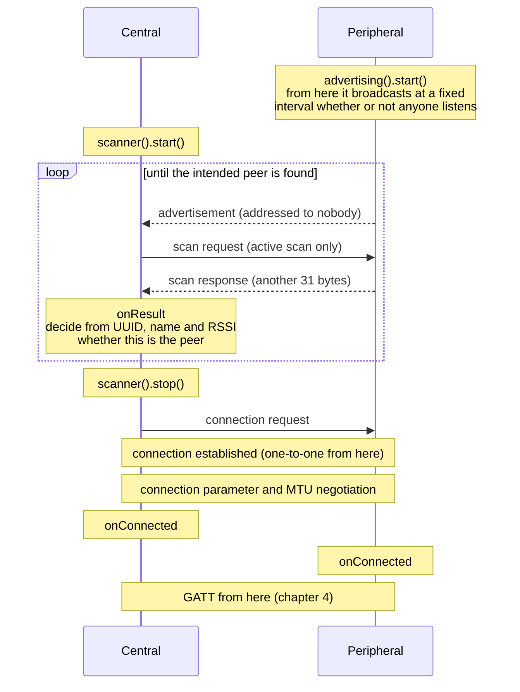
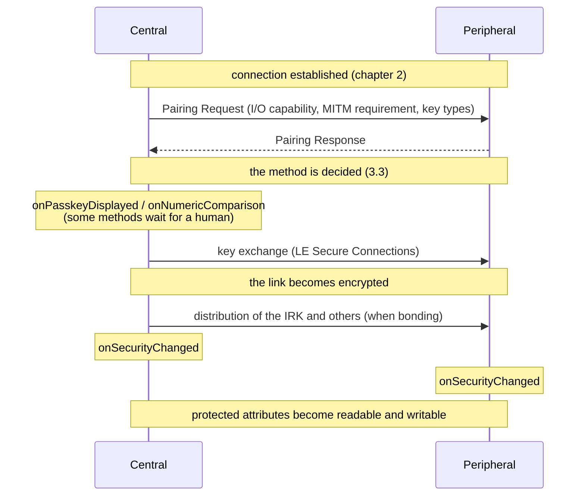
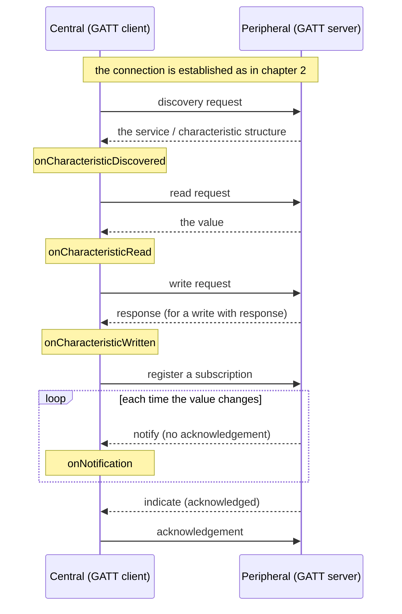

# A beginner's guide to BLE

> 日本語版: [GUIDE_BLE_BASICS.ja.md](GUIDE_BLE_BASICS.ja.md)

Written for someone using BLE for the first time, to understand **what is actually happening**. Every term is defined in this document.

The code itself lives in the examples. This document concentrates on the concepts and links to the matching example.

---

## 1. What BLE is

Bluetooth Low Energy (BLE) is a radio standard for **exchanging small amounts of data at very low power**.

The name is similar, but it is **a different thing from Bluetooth Classic** — the one behind headsets and SPP (Serial Port Profile) — and the two are not compatible.

| | Bluetooth Classic | BLE |
|---|---|---|
| Shape of the traffic | An always-connected stream | Event-oriented: short exchanges only when needed |
| What it suits | Audio (A2DP/HFP), serial (SPP) | Sensor values, key input, configuration values |
| Power draw | High | Years on a coin cell is a realistic target |

EspBle is BLE-only. The target chips, such as the ESP32-S3, have no Bluetooth Classic radio at all, so A2DP, HFP and SPP are unavailable. If you want "something like serial over BLE", you build it on top of GATT, described below.

### 1.1 GAP and GATT — two layers

The first key to understanding BLE is that **GAP and GATT do completely different jobs**.

| | GAP (Generic Access Profile) | GATT (Generic Attribute Profile) |
|---|---|---|
| Responsible for | **Finding and connecting** | **Exchanging data** |
| Deals with | Advertising, scanning, connections, addresses | Services, characteristics, reading and writing values |
| When it applies | Until the connection is established | After the connection is established |

In one line: **GAP is everything up to being connected, GATT is the conversation afterwards.** This document covers GAP in chapter 2 and GATT in chapter 4, with chapter 3 in between covering how the link is protected (security). Chapter 5 is about UUIDs, and chapters 6 and 7 cover the standard profiles that stand on GATT: HID and BLE MIDI.

### 1.2 Four roles — two independent axes

BLE has four words for roles. The confusing part is that they are **two independent axes**.

**Axis 1: the link role (a GAP matter)**

- **Peripheral** — the side that advertises and waits. It **accepts** connections
- **Central** — the side that scans and searches. It **initiates** connections

**Axis 2: the data role (a GATT matter)**

- **GATT server** — the side that **owns** the values. It answers reads and writes, and pushes changes
- **GATT client** — the side that **uses** the values. It requests reads and writes, and subscribes to changes

The typical pairing is "peripheral = GATT server" and "central = GATT client", but **that is not a rule**. Once a connection is up, either side can be a server, a client, or both. A keyboard (a peripheral) that reads the host's clock is a peripheral acting as a GATT client.

One ESP32 can be **central and peripheral at the same time**. Receiving input from a keyboard (as a central) while presenting itself to a PC as a keyboard (as a peripheral) is a workable configuration.

### 1.3 The one rule — requests and events happen at different times

Know this before reading EspBle's API.

Almost every BLE operation is **asynchronous**. Asking to connect does not connect there and then. The radio exchange finishes tens of milliseconds later at best, tens of seconds later at worst.

So EspBle splits each operation in two:

1. **The request API** — returns a `bool` immediately, saying only whether the request was accepted. Nothing has completed yet
2. **The event** — the actual completion or failure arrives later at a registered callback

And **every event is delivered from `ble.update()`, which you call in `loop()`**.

```cpp
void loop() {
  ble.update();  // only here do queued events reach their callbacks
  delay(1);
}
```

This is deliberate. The BLE stack runs on its own task, and calling back directly from there would run your application code on another thread. EspBle queues events and delivers them only on the task that called `update()` — normally `loop()`. **That is why touching shared variables inside a callback needs no locking.**

The flip side: **forget `update()` and nothing happens at all**. No scan results, no connection completions — just a "it doesn't work" that is hard to diagnose.

Because of this asynchrony, EspBle code naturally takes the shape of a **chain**: ask for an operation, then ask for the next one inside its completion event.

---

## 2. GAP — finding and connecting

This chapter follows the order in which BLE traffic actually happens: **advertising (peripheral) → scanning (central) → connecting (both)**.

### 2.1 Advertising — a peripheral announcing itself

Everything starts with the peripheral **advertising**.

Advertising means **broadcasting a short piece of data — "I am here, and I am this kind of device" — at a fixed interval**. There is no destination. Everyone within radio range can receive it.

#### What can be carried

Advertising data is a sequence of **AD structures**, each with three parts: length, type and value. The main types are:

| What it carries | Purpose |
|---|---|
| **Flags** | Basic attributes such as "connectable" and "no Classic support". EspBle emits this automatically |
| **Local Name** | A human-readable name, e.g. `EspBle Keyboard` |
| **Service UUID** | The kind of functionality offered. The single most important field for the receiver to filter on |
| **Service Data** | A value together with the service UUID it belongs to. Used by sensors that broadcast readings |
| **Manufacturer Data** | Vendor-specific data. iBeacon uses this form |
| **Appearance** | The category of device (keyboard, thermometer, …). Phones use it to pick an icon |
| **Tx Power Level** | Transmit power, so the receiver can combine it with RSSI to estimate distance |

#### The 31-byte wall

Here is the first obstacle: **advertising data holds only 31 bytes.**

Worse, each AD structure spends two bytes (length and type) on top of its value. One 128-bit service UUID costs 16 + 2 = 18 bytes; with the 3 bytes of Flags, only 10 are left.

The mechanism that relieves this is the **scan response**. When a receiver asks for more, the peripheral can return **another 31 bytes** — 62 in total.

- **The advertising payload** — reaches everyone nearby. Put the bare minimum needed to identify the device here
- **The scan response** — reaches only those who asked. Put bulky information such as the name here

If you do not specify a scan response, EspBle **places the device name there automatically**, so the name does not eat into the 31 bytes. To decide the split yourself, `advertising().data()` and `advertising().scanResponse()` return the builder for each side.

> **Why 31 bytes, and why it cannot be raised**
> This is the specification limit of **legacy advertising**, present since BLE 4.0. BLE 5.0's **extended advertising** raises it to 255 bytes, but EspBle cannot use it: the NimBLE bundled with Arduino-ESP32 is built with `CONFIG_BT_NIMBLE_EXT_ADV` disabled, and an Arduino library has no way to change that setting.

#### Connectable and non-connectable advertising

There are two kinds:

- **Connectable** — "you may connect". The normal peripheral case (the default)
- **Non-connectable** — broadcast only, connections not accepted. This is what a **beacon** is. Switch with `advertising().setConnectable(false)`

A beacon puts the value itself into the advertisement and skips the whole connection procedure: a temperature sensor broadcasting every five seconds, a shelf broadcasting an identifier. Since receivers do not connect, **any number of them can receive one beacon at once**.

#### Advertising interval

`advertising().setInterval(minMs, maxMs)` sets the broadcast interval from 20 ms to 10.24 s. The trade-off is plain:

- **Short** — found quickly, at the cost of power
- **Long** — battery lasts, but peers take longer to find it

Note that the specification requires non-connectable advertising to use **100 ms or more**.

#### Restricting it to one peer (directed advertising)

Where ordinary advertising says "anyone welcome", **directed advertising names the destination address**, and only that peer may connect. Set it with `advertising().setDirectedTarget(address, addressType)`, and `clearDirectedTarget()` returns to normal advertising.

The main use is a fast reconnection to a bonded peer. Passing `true` as the third argument selects **high duty cycle**, which transmits every 3.75 ms for up to 1.28 s and re-establishes the link extremely quickly (it stops by itself after 1.28 s). With `false` (the default) it uses the normal interval and continues until stopped.

There are two constraints:

- **No payload can be carried at all.** This is a specification constraint: a directed advertisement carries only two addresses. Neither the name nor service UUIDs are sent, so the peer does not "find it by scanning and connect" — it **connects by specifying the address**
- If the peer uses an RPA (2.4), give its **identity address**, not the address currently on air. Resolution goes through the bond, so **the peer must be bonded first**

On the receiving side, only directed advertisements addressed to this device arrive as scan results (the controller discards the rest). Such a result carries only the address, address type and RSSI; the connectable flag is set and the scannable flag is not. Connecting works as usual. However **there is no way to tell that a result was a directed advertisement** — EspBle does not expose the advertising type — so it has to be inferred from the combination "connectable, not scannable, no data".

#### Choosing advertising channels

Advertising uses three channels (37, 38, 39). `advertising().setChannelMap(mask)` narrows which ones are used; the mask is a bit mask of `EspBleAdvertisingChannel37` / `38` / `39`, and passing 0 restores all three.

The use case is avoiding a channel that overlaps congested Wi-Fi. Note that using fewer channels **lengthens the time it takes to be found**.

#### Related examples

| Example | Contents |
|---|---|
| [Gap/Advertise](../examples/Gap/Advertise/) | Minimal advertising with a name and a service UUID |
| [Gap/ScanResponse](../examples/Gap/ScanResponse/) | Splitting across two payloads to get past the 31-byte limit |
| [Gap/Beacon](../examples/Gap/Beacon/) | A non-connectable beacon carrying manufacturer data |
| [Gap/IBeacon](../examples/Gap/IBeacon/) | The iBeacon layout defined by Apple |
| [Gap/ServiceData](../examples/Gap/ServiceData/) | Broadcasting a sensor reading as service data |
| [Gap/DirectedAdvertise](../examples/Gap/DirectedAdvertise/) | Advertising at one named peer (no payload is carried) |

### 2.2 Scanning — a central looking for peers

A central receives advertisements by **scanning**.

#### Passive and active

There are two kinds, selected by `active` in the `EspBleScanConfig` passed to `scanner().start()`.

| | `active` | Behaviour | What you receive |
|---|---|---|---|
| **Active scan** | `true` (default) | Answers each advertisement with a **scan request** | The advertising payload **plus the scan response** |
| **Passive scan** | `false` | Listens only; transmits nothing | The advertising payload only |

As described above, the name usually lives in the scan response, so **finding a peer by name requires an active scan**. That is why `true` is the default.

The advantage of a passive scan is that this device emits nothing: lower power, and it does not announce its presence. If a service UUID is enough to identify the peer, passive is sufficient.

#### Interval and window

`EspBleScanConfig` also carries the two settings that decide scanning time:

- **interval** — how often a scan starts. `intervalMilliseconds`
- **window** — how much of that time is actually spent listening. `windowMilliseconds`

With interval 100 ms and window 50 ms, **the radio is listening half the time**; the other half is free for other work. Setting window = interval listens continuously, at maximum power.

`durationSeconds` sets how long to keep scanning; `0` means until stopped.

#### Receiving only chosen peers

The Filter Accept List applies not only on the advertising side (who may connect, 2.3) but **on the scanning side too**. Setting `EspBleScanConfig::acceptListOnly` to `true` makes the controller drop advertisements from peers that are not on the list, so they never reach `onResult`.

The difference from filtering in the application is that no wasted work happens at all. Matching is by address, so a peer that rotates a Resolvable Private Address cannot be listed usefully until it is bonded and its identity address applies.

#### The problem of missing advertisements

This is what trips people up most in practice.

An advertisement is an instantaneous broadcast, and anything that arrives while the scan window is closed is **not received**. BLE also cycles through three channels, which loses more depending on timing.

So **failing to find a device in one scan does not mean it is not there**. In practice:

- Scan for **3–5 seconds** normally
- Take longer in an environment crowded with BLE devices
- To wait for one specific peer, scan without a time limit until it appears

#### What a result contains

One scan result (`EspBleScanResult`) holds what was extracted from the advertisement (and the scan response, on an active scan): `address`, `addressType`, `rssi` (signal strength), `connectable`, `name`, `serviceUuids`, `serviceData` and `manufacturerData`.

Use `advertisesService(uuid)` to test whether a peer carries the service UUID you want. UUIDs are compared by value, so the short form and the full form both match.

RSSI is in dBm, and closer to zero means closer by. As a feel for it, −40 is very close and −90 is quite far.

#### The duplicate-filter trap

A device's advertisements arrive over and over. EspBle **filters duplicates** by default and reports each device once, which is easier to work with when all you want is a list of what is around.

Here is the trap: **for a device whose payload keeps changing, only the first value arrives.** A sensor beacon that updates its temperature every five seconds delivers exactly one reading, and every later update looks like it was never sent. The transmitter is broadcasting correctly, which makes the cause hard to spot.

To follow a beacon's values, set `wantDuplicates` to `true` in the `EspBleScanConfig` passed to `scanner().start()`. The setting is applied when the scan starts, so to change it while running, stop the scan and start it again.

The cost is volume: every advertisement from every device nearby now arrives, and anything the application cannot keep up with is dropped. If you already know which device you want, filter first.

Appearance and Tx Power Level, when present, are available as `appearance` and `txPowerLevel` (`hasTxPowerLevel()` reports presence). Tx power is particularly useful: **the gap between the declared transmit power and the RSSI is the path loss**, which is the basis of distance estimation. RSSI alone cannot distinguish a nearby device transmitting weakly from a distant one transmitting strongly.

One advertisement may carry several service data blocks. Do not rely on their order — use `serviceDataFor(uuid, data)` to take the block you want by UUID. UUIDs are compared by value, so a 16-bit short form matches too.

#### Related examples

| Example | Contents |
|---|---|
| [Gap/Scan](../examples/Gap/Scan/) | Minimal scanning, printing address, RSSI and name |
| [Info/ScanDump](../examples/Info/ScanDump/) | Every field that can be extracted, plus iBeacon decoding |
| [Gap/AcceptList](../examples/Gap/AcceptList/) | One accept list used both to restrict connections and to filter scanning |

For a use that needs no connection — receiving beacons — everything ends here.

### 2.3 Connecting — forming a one-to-one relationship

Once the intended peer is found, you **connect**. Only a central can start a connection.

#### Deciding before connecting

Do not connect to every device you find. The number of simultaneous connections is limited (three on the ESP32-S3 in the NimBLE build EspBle uses), and a pointless connection consumes that budget.

A scan result carries everything needed to decide:

- **Service UUID** — does it have the functionality you want? The most reliable criterion
- **Name** — easy for a human to recognise, though several devices may share one
- **Connectable flag** — a beacon cannot be connected to
- **Address** — when you want one specific device
- **RSSI** — when you want to add a "close enough" condition

Combining several is the practical approach: "has this service UUID, and RSSI stronger than −70", for instance.

#### Can a peripheral refuse a connection?

**Not from application code.**

BLE has no "a connection request arrived, do you approve it?" enquiry. The controller decides, and the application only learns about it after the connection is established.

There are three ways to restrict it:

| Approach | Effect | API |
|---|---|---|
| **Filter Accept List** | The controller silently drops connection requests from peers that are not listed. The most reliable | `addToAcceptList()` plus `advertising().setFilterPolicy()` |
| **Disconnect after connecting** | Inspect the peer and disconnect. The connection does get established once | `disconnect()` inside `onConnected()` |
| **Protect the attributes with encryption** | Allow the connection, but require pairing to read or write values (chapter 3) | `encryptedRead` / `encryptedWrite` on a characteristic |

Note that a rejected peer is not told it was rejected. The Link Layer has no PDU for refusing, so the request is simply ignored; from the peer's side it looks like a connection that timed out with no answer.

#### Once the connection is up

After connecting, every exchange happens **inside that one-to-one link only**. Nothing leaks to the surroundings the way advertising does.

A connection has the following parameters, which decide responsiveness and power draw:

- **Connection interval** — how often there is an opportunity to communicate. Shorter is more responsive and costs more power
- **Peripheral latency** — how many opportunities the peripheral may skip. It saves power when there is nothing to send
- **Supervision timeout** — how long communication may be absent before the link counts as lost

The current values are readable from the connection information (`EspBleConnection`) as `connectionInterval`, `peripheralLatency` and `supervisionTimeout`. For changing them, see 2.7.

The other important one is the **MTU** (Maximum Transmission Unit): the upper bound on how many bytes one exchange can carry. Both sides exchange their preferred value when connecting, and **the smaller one wins**.

The specification minimum is 23 bytes. Three of those go to protocol headers, so only **20 bytes** are actually usable. EspBle defaults to 247, which carries 244 bytes in one go. Anything larger has to be split.

The negotiated result is `EspBleConnection::mtu`, and the number of bytes that fit in one send is `maximumNotificationPayload()`.

When a connection drops, a disconnect event arrives carrying the reason code, so you can tell apart "we disconnected", "the peer disconnected" and "the radio went away" (supervision timeout). You can also choose the code sent to the peer with the second argument of `disconnect(id, reason)`, and that value appears unchanged in the peer's `disconnectReason`.

#### Related examples

| Example | Contents |
|---|---|
| [Gap/Connect](../examples/Gap/Connect/) | Filter by service UUID, connect, and handle connect / disconnect / failure |
| [Gap/AcceptList](../examples/Gap/AcceptList/) | Restrict who may connect with the Filter Accept List (the same list also filters scanning) |
| [Gap/Mtu](../examples/Gap/Mtu/) | The MTU exchange and how many bytes fit in one send |
| [Info/ConnectionInspector](../examples/Info/ConnectionInspector/) | Observing connection parameters and the PHY |

### 2.4 Addresses and privacy

Every advertisement carries the sender's **address** (6 bytes). That is a problem.

If you use the factory address (the **public address**) as-is, **it never changes, so anyone nearby can track your device**. For something carried around, that is a real concern.

BLE offers three kinds of address:

| Kind | Nature | Resistance to tracking |
|---|---|---|
| **Public** | The fixed factory value | None |
| **Random static** | A fixed random value generated at start-up | Hides the factory address, but the value itself is trackable |
| **Resolvable Private Address (RPA)** | Rotated periodically by the controller | High |

An RPA changes at intervals, so from the outside it looks like a different device. But then **legitimate peers lose track of it too**.

What solves this is **bonding**: the mechanism for storing the keys created during pairing, covered in detail in 3.2. Bonding also exchanges an **IRK** (Identity Resolving Key), with which the peer computes the RPA and recovers "this is that device from before". To a third party without the key, it is just a changing random address.

So **an RPA is only meaningful together with bonding**. Use an RPA without bonding and peers can never reconnect.

The unchanging address that identifies a bonded peer is called its **identity address**. Since the Filter Accept List matches on address, a peer that uses an RPA can only be listed usefully once it is bonded and its identity address applies.

> **The RPA rotation period cannot be changed**
> It is fixed by the bundled NimBLE's build configuration (`CONFIG_BT_NIMBLE_RPA_TIMEOUT`, 900 seconds), and an application has no way to change it.

`localAddress()` reports which address this device is currently using (and `localAddressType()` its kind). It is the value a peer needs in order to put this device on its Filter Accept List, and with an RPA it changes each time the controller rotates it.

Related example: [Gap/PrivateAddress](../examples/Gap/PrivateAddress/)

### 2.5 What to decide at initialisation

To close out GAP, here are the settings decided before communication starts. They are given at initialisation and affect everything afterwards.

All of them go into `EspBleConfig` and are passed to `begin()`.

| Setting | Contents | Field |
|---|---|---|
| **Device name** | The name shown to peers while advertising and after connecting | `deviceName` |
| **Preferred MTU** | Bytes per exchange, default 247. Larger is more efficient but costs memory per connection | `preferredMtu` |
| **Own address type** | Public / random static / RPA (2.4) | `ownAddressType` |
| **Security** | Enabling pairing and bonding, and the authentication method | `security` |

The reason to lower the MTU would be saving memory across many simultaneous connections. There is normally no problem with the default of 247.

**The MTU is decided *after* the connection is established.** The exchange runs just after connecting, so at `onConnected` both sides still report the default of 23, and the negotiated value arrives at `onMtuChanged`. The order is the same for central and peripheral. If you send a large amount of data right after connecting, wait for `onMtuChanged` rather than `onConnected`.

**Transmit power** is changed with `setTxPower(dBm)`, and the value actually applied is readable with `txPower()`. Raising it extends range; lowering it reduces current draw. The radio supports discrete steps only (−12 to +9 dBm in 3 dB steps on the bundled build), and the closest one to the requested value is applied. This is not limited to initialisation — it can be changed at any time and affects advertising, scanning and connections alike. If you advertise a Tx Power Level, that value follows too.

Security (`security`) has many settings, so chapter 3 covers it all together.

Related example: [Gap/Mtu](../examples/Gap/Mtu/)

### 2.6 The whole GAP flow in time order

Advertising through to an established connection, as one sequence. The scan request is sent **only on an active scan**.



For a beacon use that needs no connection, everything ends at `onResult`.

### 2.7 What GAP does not support

Features that exist in the BLE specification but are unavailable in EspBle, with the reasons.

#### Extended advertising / periodic advertising

Added in BLE 5.0: payloads up to 255 bytes (extended) and receiving periodic data without connecting (periodic).

**Unavailable.** The bundled NimBLE is built with `CONFIG_BT_NIMBLE_EXT_ADV` disabled, and an Arduino library has no way to change that setting. Periodic advertising is built on extended advertising, so it is unavailable for the same reason.

The consequence is that advertising is capped at 31 bytes × 2 payloads (the advertisement and the scan response).

#### Specifying parameters at connect time

Specifying the connection interval or the PHY at the moment of connecting is **not possible**: the bundled backend's connect API does not accept them.

This is not an obstacle in practice. **The connection is established with values the controller chose, and changes can be requested afterwards.** Request parameters with `updateConnectionParameters()` and the PHY with `updatePhy()`; the results arrive at `onConnectionParametersUpdated()` and `onPhyUpdated()`. Both requesting and receiving work from either role. See [Gap/ConnectionParameters](../examples/Gap/ConnectionParameters/) for the procedure.

---

## 3. Security — how far to trust the peer you connected to

Being connected tells you neither who the peer is nor whether the exchange is being watched. Deciding that is what this chapter is about.

In BLE, a layer that stands **alongside GAP and GATT** handles it: **SMP** (Security Manager Protocol). GAP gets you connected, SMP decides how far to trust, and GATT states that trust requirement per attribute. This chapter covers link-level policy; per-attribute requirements are in chapter 4.

### 3.1 What you are protecting against

"Turning on security" gets treated as one thing, but there are three targets and **each needs a different countermeasure**.

| Threat | What it is | Countermeasure |
|---|---|---|
| **Eavesdropping** | Intercepting the radio and reading the contents | **Encryption**, which pairing gives you |
| **Impersonation (MITM)** | Sitting in the middle and impersonating both sides | **Authenticated pairing**: a passkey or similar confirms both sides see the same peer |
| **Tracking** | Following an individual device by its unchanging address | **RPA** (2.4), used together with bonding |

The important part: **encryption alone does not stop impersonation.** Pairing without a passkey (Just Works) has no way to confirm the key exchange happened with the genuine peer. A man in the middle who pairs separately with each side passes everything through, correctly encrypted on both halves.

EspBle surfaces this distinction directly in the result. In the connection information delivered to `onSecurityChanged`, `encrypted` is the eavesdropping countermeasure and `authenticated` is the impersonation one. Just Works produces `encrypted=1, authenticated=0`.

### 3.2 Pairing and bonding

These two get conflated, but they are different things.

- **Pairing** — the procedure that creates keys on the spot and encrypts the link. The keys are gone once you disconnect
- **Bonding** — **both sides storing** the keys created by pairing so they can be reused on the next connection

With bonding, the second connection onwards does not redo the key exchange. Encryption starts immediately, using the stored keys, and a passkey has to be entered only once. **The experience of "pair once and never do anything again" only exists because of bonding.**

It is not only the encryption key that is stored. An **IRK** (Identity Resolving Key) is exchanged too, and that is what resolves an RPA (2.4). This is why an RPA is only meaningful together with bonding.

Bond information survives a power cycle (it is stored in NVS). That means **a way to erase it is necessary**, which is what `deleteBond()` and `deleteAllBonds()` are for. If only one side deletes its bond and then reconnects, the key mismatch either forces pairing again or fails outright. Do not delete on one side only.

### 3.3 The pairing method follows from the I/O capabilities

**An application cannot choose the pairing method directly.** Both sides declare what they can display and what they can type (their **I/O capability**) and whether they require MITM protection, and the method **follows automatically** from that combination.

| Method | Conditions | User action | `authenticated` |
|---|---|---|---|
| **Just Works** | Either side does not require MITM, or one side's I/O capability is `None` | None | 0 |
| **Passkey Entry** | One side displays (`DisplayOnly`), the other types (`KeyboardOnly`) | Six digits shown on one side, typed on the other | 1 |
| **Numeric Comparison** | Both sides are `DisplayYesNo` and both require MITM | The same six digits appear on both; the user confirms they match | 1 |

A practical conclusion follows. **A device with no buttons and no screen cannot obtain MITM protection at all**, because with neither input nor output there is no way for a human to confirm both sides see the same peer. Lying about the I/O capability and declaring `DisplayOnly` does not help: the peer cannot type a passkey that was never displayed, so pairing simply fails.

One more point: **Numeric Comparison requires LE Secure Connections on both sides.** EspBle always operates with LE Secure Connections, so it will not be chosen against a peer older than BLE 4.2.

### 3.4 When encryption begins

There are three timings, and the choice shapes the design.

**1. At the same time as connecting (`pairOnConnect`)**

Pairing starts as soon as the connection comes up. Everything afterwards happens encrypted, which is the easiest form to reason about. This is EspBle's default.

**2. When the application asks explicitly (`requestSecurity()`)**

For encrypting only after inspecting some condition. Called from the central side.

**3. The moment a protected attribute is touched**

Mark a characteristic with `encryptedRead` and similar, and a read or write over an unencrypted link fails at the ATT layer (insufficient encryption). Most operating systems respond to that error by **starting pairing automatically**, which is how "ask for authentication only when it is needed" is achieved.

In every case the result arrives at `onSecurityChanged`. **Protected attributes cannot be read until that callback fires.** Issuing a read straight after connecting races with both case 1 and case 3.



### 3.5 Configuring it in EspBle

The policy is given as a whole in `EspBleConfig::security` and passed to `begin()`. **It cannot be varied per connection.**

| Field | Default | Contents |
|---|---|---|
| `enabled` | `false` | Enables the security features. With this `false`, none of the others may be set |
| `bonding` | `true` | Store the keys for next time (3.2) |
| `pairOnConnect` | `true` | Start pairing at the same time as connecting (3.4, case 1) |
| `mitm` | `false` | Require impersonation protection. `true` needs an I/O capability |
| `ioCapability` | `None` | `None` / `DisplayOnly` / `KeyboardOnly` / `DisplayYesNo` (3.3) |
| `staticPasskeyEnabled` / `staticPasskey` | `false` / `0` | Fix the passkey instead of handling it at runtime |

Contradictory combinations are rejected by `begin()` with `InvalidArgument`: MITM specified while `enabled=false`, MITM with an I/O capability of `None`, a passkey without MITM, and so on. **Nothing is silently ignored, leaving you running with weaker settings than you asked for.**

A static passkey is simple to wire up, but **since the value is compiled into the sketch it is no secret**: anyone who can read the source is unimpeded. For real use, choose the runtime form (a human relays the value shown by `onPasskeyDisplayed`).

The matching callbacks and APIs:

| API | Role |
|---|---|
| `onSecurityChanged(cb)` | Whether pairing succeeded, and the resulting security state |
| `onPasskeyDisplayed(cb)` | When this device is the display side, the six digits to show |
| `onNumericComparison(cb)` plus `confirmNumericComparison(bool)` | A human confirms the six digits shown on both sides match, and answers |
| `providePasskey(uint32_t)` | When this device is the input side (`KeyboardOnly`), hand over the six digits |
| `requestSecurity(id)` | Start pairing explicitly (3.4, case 2) |
| `bondCount()` / `bond(i, out)` / `deleteBond()` / `deleteAllBonds()` | Enumerate and delete stored bonds |

When deleting bonds, **disconnect everything first**. Deleting a bond that is in use leaves the link's keys and the stored contents out of step.

### 3.6 Limits

With the reasons.

- **Only three bonds can be stored** — the bundled NimBLE is built with `CONFIG_BT_NIMBLE_MAX_BONDS=3`, and an Arduino library has no way to change it. Bonding with a fourth peer pushes the oldest one out. Not suitable for remembering many peers
- **The BLE host stops while a passkey is being answered** — entering a passkey (`providePasskey`) and confirming a numeric comparison (`confirmNumericComparison`) halt the host task while SMP waits for the answer. By specification, pairing is a procedure that advances only on the answer, so nothing else can be interleaved. **It gives up after 30 seconds and pairing fails.** Do not build anything that waits a long time inside `loop()`
- **OOB (out of band) pairing is unavailable** — the method of handing keys over another channel such as NFC. The channel itself does not exist on the ESP32 side, so it is not supported
- **Signed writes (CSRK) are unavailable** — the mechanism that protects integrity with a signature instead of encryption. The keys exchanged are limited to the encryption key and the IRK, because virtually no real device uses this
- **The pairing method cannot be chosen directly** — as in 3.3, the specification derives it from the I/O capabilities, and BLE has no API for it

### 3.7 Related examples

| Example | Contents |
|---|---|
| [Security/JustWorksServer](../examples/Security/JustWorksServer/) | A characteristic that requires encryption, with Just Works plus bonding |
| [Security/StaticPasskeyServer](../examples/Security/StaticPasskeyServer/) | The display side (`DisplayOnly`) of MITM-authenticated pairing |
| [Security/StaticPasskeyClient](../examples/Security/StaticPasskeyClient/) | The input side (`KeyboardOnly`), reading a protected value after authentication |
| [Security/RuntimePasskeyServer](../examples/Security/RuntimePasskeyServer/) | Generating and displaying a passkey per pairing (no fixed value) |
| [Security/RuntimePasskeyClient](../examples/Security/RuntimePasskeyClient/) | Handing over the displayed value at runtime with `providePasskey()` |
| [Security/NumericComparisonServer](../examples/Security/NumericComparisonServer/) | Confirming the six digits shown on both sides (peripheral) |
| [Security/NumericComparisonClient](../examples/Security/NumericComparisonClient/) | The central half of the same |

---

## 4. GATT — exchanging data

With a connection established, this is GATT's territory.

### 4.1 The structure of GATT

GATT represents data in three levels.

- **Service** — a group of functionality: "battery", "heart rate monitor"
- **Characteristic** — an individual value: "battery level", "heart rate". Several fit in one service
- **Descriptor** — supplementary information attached to a characteristic: a unit, a description, or the on/off setting for notifications

Each has a UUID as its identifier (chapter 5 covers those in detail).

But **a UUID is a type, not an identity.** The specification lets one device expose several services, or several characteristics, with the same UUID. A HID keyboard lining up several Report characteristics under the same UUID is the everyday example.

So in EspBle, **you name the target with the handle returned at registration**. `addService()` returns the service handle, passing it to `addCharacteristic()` returns the characteristic handle, and later value changes and notifications use that handle. Events (a write, a subscription change) also carry the target handle, so a shared UUID is not ambiguous.

On the client side, a peer's characteristic can be named by **attribute handle**. That is how the same-UUID Report characteristics of a HID device are addressed individually. Descriptors have the same addressing — a HID Report Reference (0x2908) is "the 0x2908 under this 0x2A4D characteristic", which no combination of UUIDs can express.

#### How far duplicate UUIDs are supported

Every duplication the specification allows **works in both roles**.

| | Several **services** with the same UUID | Several **characteristics** with the same UUID in one service |
|---|---|---|
| **Peripheral (the side exposing them)** | Yes | Yes |
| **Central (the side reading them)** | Distinguishable (name it by attribute handle) | Distinguishable (name it by attribute handle) |

On the peripheral side, the handles returned by `addService()` and `addCharacteristic()` identify the target. EspBle builds the attribute table directly through the BLE stack's API (`ble_gatts_add_svcs()`), and read/write notifications are matched using the "which definition" information the stack passes back, so a shared UUID is never confused.

On the central side, whatever the peer duplicates can be addressed by attribute handle. Discovery is performed with APIs such as `ble_gattc_disc_all_svcs()`, and reads, writes and subscriptions (CCCD writes) are all issued against attribute handles directly. Notifications are matched by the handle they arrived from. **Descriptors are addressable by handle too** (`readDescriptor(id, descriptorHandle)` / `writeDescriptor(...)`). A descriptor belongs to a characteristic, so when characteristics repeat a UUID no combination of UUIDs can pick one out. In the result, `descriptorHandle` is the descriptor addressed and `handle` is the characteristic that owns it.

There is one restriction. **Automatic subscription restore after a reconnect is limited to characteristics with a unique UUID.** The restore keys on the peer's address and the UUID, so with duplicates it cannot say which one was subscribed. Where that applies, re-subscribe by handle yourself after reconnecting.

### 4.2 The four operations

The ways to move values:

| Operation | Direction | Description |
|---|---|---|
| **Read** | Client → server | Read a value |
| **Write** | Client → server | Write a value; with or without a response |
| **Notify** | Server → client | Push a change. No acknowledgement |
| **Indicate** | Server → client | The same, but waits for the client's acknowledgement |

**Only the client can issue requests.** A server cannot ask to read or write. All it can send on its own initiative is notifications and indications, and even those require the subscription described next.

#### Subscribing — the client decides whether sending is allowed

Notifications and indications only reach clients that **subscribed** beforehand. The subscription state lives in a **CCCD** (Client Characteristic Configuration Descriptor), a descriptor added automatically to any notifiable or indicatable characteristic. The client writes a bit there to subscribe.

What matters is that **each connection has its own CCCD**. With three peers connected there are three states, and it is normal for only one to be subscribed. The server sends only to subscribed connections and sends nothing to the others. **The send does not fail — there is simply nowhere for it to go.**

Subscriptions are dropped on disconnect. However, EspBle's client side remembers them by default and **restores them automatically** when reconnecting to the same peer (`EspBleConfig::persistentSubscriptions`), so the application does not have to re-subscribe.

#### Choosing between notify and indicate

The criterion is **whether a loss is acceptable**. A sensor value updated several times a second suits notify (if one is lost, another follows); the result of a configuration change that must arrive suits indicate.

Indicate waits for an acknowledgement each time, so **only one can be in flight at once**. Sending several in a row means waiting for the previous acknowledgement, which costs throughput. In EspBle the send result arrives at `onSent()`, and for indicate it means "the client received it".

### 4.3 Declaring protection per attribute

The link policy decided in chapter 3 is applied to **specific values** here. A characteristic (and a descriptor) configuration carries these flags:

| Flag | What it requires |
|---|---|
| `encryptedRead` / `encryptedWrite` | The link is encrypted (pairing has happened) |
| `authenticatedRead` / `authenticatedWrite` | And that it is MITM-authenticated (a passkey or similar was involved) |

When a read or write from a link that does not meet the condition reaches a flagged attribute, **the ATT layer returns an error** (insufficient encryption / insufficient authentication). Application code is not called. Most operating systems respond to that error by starting pairing automatically, which is how "ask for authentication only when it is needed" is written.

Read and write are specified separately. "Anyone may read it, but changing it requires authentication" is just `authenticatedWrite` on its own.

**Protection is per attribute, not per service.** One service can mix a freely readable value with one that demands authentication.

### 4.4 The server side — decide everything you expose up front

A GATT server's configuration is **all registered before `begin()`**. The attribute table is finalised and started at `begin()`, so services cannot be added later (it fails with `InvalidState`).

Registration is a **three-step handle chain**:

```cpp
service = gattServer.addService(SERVICE_UUID);
characteristic = gattServer.addCharacteristic(service, CHAR_UUID, config);
descriptor = gattServer.addDescriptor(characteristic, DESC_UUID, descriptorConfig);
```

Every later value, send, and event check uses those handles, because as in 4.1 a UUID cannot point at "which one". **There is one event per kind of operation** (shared by every characteristic), so with several registered, identify the target by handle.

There are two ways to hold a value:

- **Store it ahead with `setValue()`** — for data this device already knows has changed. A read is answered by the stack with that value
- **Produce it when read with `onRead()`** — for a sensor-style value that should reflect the moment of the read. Whatever the callback passes to `setValue()` goes out to the peer. If nobody reads it, the work of producing it never runs

`onRead()` has a constraint the others do not. **This callback alone runs on the BLE stack task, not from `update()`**, because the value must exist before the ATT response goes out and there is nowhere to defer it to. So it must be short (blocking stalls the whole stack, and the peer sees the read time out), and since it runs concurrently with `loop()`, shared state needs synchronisation.

The limits come from EspBle's own fixed arrays: **8 services, 32 characteristics, 16 descriptors**. The CCCDs attached to notify/indicate characteristics are provided by the stack and do not count against those 16.

### 4.5 The client side

A client does not know the peer's data structure, so it first performs **discovery** to find where the intended service and characteristic are, and then reads, writes or subscribes.

As explained in 1.3, all of this is asynchronous. You write it as a chain: ask for discovery, ask for a read inside its completion event, ask for a write inside that completion event.

There is one more constraint on top. **A central runs only one GATT operation at a time.** Requesting a second while one is in flight fails synchronously with `InvalidState`. The procedure cannot be written top to bottom; it is always a chain.

There are two kinds of discovery:

- **Enumeration** (`discoverServices()`) — lists the peer's whole GATT database and holds it as a **per-connection snapshot**, valid until the connection drops or the next enumeration. Queries such as `discoveredService*()` read that snapshot without touching the radio
- **Known-UUID discovery** (`discoverCharacteristic()`) — resolves only the UUID you want. Faster and lighter when you already know what you need

### 4.6 Value size and the MTU

One exchange carries MTU − 3 bytes (2.3): 244 bytes with the default MTU of 247. Values larger than that are handled **asymmetrically between reads and writes**.

- **Reads are split automatically.** A value that does not fit one response is completed by the client asking for the rest and joining it up (**Read Long**). EspBle always reads this way, so `result.value` holds the whole thing and nothing has to be reassembled by the application. Without it, a long value would silently arrive truncated
- **Writes are not split.** A write goes out as a single ATT request; Long Write (writing across several requests) is not performed, because whether splitting works also depends on the peer's implementation

Notify and indicate also carry only what fits in one send and are not split. The number of bytes actually available is reported by `maximumNotificationPayload()`. **The MTU is only settled after the connection** (2.5), so start anything that sends a large amount of data after `onMtuChanged`.

### 4.7 The whole flow in time order



Every event is delivered from `ble.update()` in `loop()`. The callback runs **the next time you call `update()`**, not right after the request (with `onRead()` the sole exception, running on the stack task as described in 4.4).

### 4.8 Standard and custom services

UUIDs come in **standard** ones, whose meaning the Bluetooth SIG defined, and **custom** ones you choose yourself (chapter 5). Common functionality — heart rate monitors, thermometers, battery level — has standard services and characteristics defined, right down to the byte layout of the values. Follow those and a generic phone app or an off-the-shelf device can read your device without you writing anything for it.

**Most standard services have no dedicated class.** Heart rate monitors, thermometers, battery level, fitness equipment — all of them are assembled with the generic API of 4.4 (`addService()` / `addCharacteristic()`). What the standard side provides is only the agreement on UUIDs and byte layout; as a GATT mechanism it is no different from a custom service. Adding dedicated classes would add one half-implemented abstraction per specification.

The cost is that you write the byte layout yourself. The examples under `examples/Gatt/Health` and `examples/Gatt/Fitness` implement real standard services in exactly that form. Only the conversions with **no room for judgement** — the special floating-point format medical values use, CRC computation — are provided as headers (`EspBleMedicalFloat.h`, `EspBleCgmCrc.h`).

The only dedicated classes are for **HID and BLE MIDI**, because those two do not end at "a UUID and a byte layout". HID requires assembling a Report Descriptor, which is a separate description language, and switching to and from the Boot Protocol. BLE MIDI needs 13-bit timestamping and running-status handling on every packet. Both involve a large amount of boilerplate that fails silently when it is wrong, so an abstraction is worth having.

Those dedicated classes take the generic events as additional listeners registered through `add*Listener()`. That is why **you can install your own callback for the same event while using a dedicated class** — the `on*()` primary is not taken from you.

Connection events work the same way (`onConnected` / `onDisconnected` / `onConnectionFailed` / `onSecurityChanged` / `onMtuChanged` / `onConnectionParametersUpdated` / `onPhyUpdated`). Register extras with `addConnectedListener()` and friends, and drop them with `removeConnectionListener()`. A layer of your own can follow connections without taking the application's `on*()` slot.

The exceptions are `onPasskeyDisplayed` and `onNumericComparison`, which stay **single primary callbacks**. Those two exist to be answered, not observed (`providePasskey()` / `confirmNumericComparison()`), and with several observers it would be undecided which one is responsible for replying.

Use custom UUIDs for your own functionality. **Reusing a standard UUID for another meaning makes generic apps misinterpret it.**

### 4.9 What GATT does not support

| Feature | Reason |
|---|---|
| **Long Write** (split writes) | As in 4.6, a write goes out as a single ATT request. Whether splitting works also depends on the peer's implementation, so it cannot be made reliable |
| **Signed writes (CSRK)** | The mechanism that protects integrity with a signature instead of encryption. The keys exchanged are limited to the encryption key and the IRK, because virtually no real device uses it (3.6) |
| **Several `onRead()` observers** | Unlike the other events there is only one, because only one place can own the decision of what value to return |
| **Subscription restore for same-UUID characteristics** | As in 4.1, the restore keys on the address and the UUID, so with duplicates it cannot say which one was subscribed. Re-subscribe by handle where that applies |

### 4.10 Related examples

| Example | Contents |
|---|---|
| [Gatt/Basics/Server](../examples/Gatt/Basics/Server/) | A server exposing a custom service and characteristic |
| [Gatt/Basics/Client](../examples/Gatt/Basics/Client/) | The discovery → read → write chain |
| [Gatt/Basics/NotifyServer](../examples/Gatt/Basics/NotifyServer/) / [SubscribeClient](../examples/Gatt/Basics/SubscribeClient/) | Sending notifications and subscribing |
| [Gatt/Basics/IndicateServer](../examples/Gatt/Basics/IndicateServer/) / [IndicateClient](../examples/Gatt/Basics/IndicateClient/) | Acknowledged indications |
| [Gatt/Basics/NusServer](../examples/Gatt/Basics/NusServer/) / [NusClient](../examples/Gatt/Basics/NusClient/) | The equivalent of serial communication |
| [Gatt/Basics/AutoReconnectClient](../examples/Gatt/Basics/AutoReconnectClient/) | Restoring the link and the subscription after a disconnect (4.2) |
| [Gatt/Device/BatteryServer](../examples/Gatt/Device/BatteryServer/) and others | Minimal standard services built with the generic API (4.8) |
| [Gatt/Health](../examples/Gatt/Health/) / [Gatt/Fitness](../examples/Gatt/Fitness/) | The byte layouts and procedures of real standard services |

---

## 5. Understanding UUIDs

### 5.1 A UUID is a label for a *type* of functionality

What a service or characteristic *is* is expressed by its **UUID** (Universally Unique IDentifier): a 128-bit (16-byte) globally unique identifier.

```
5266f727-49d7-4eaf-a6f1-636f6e6e6563   (hex digits in an 8-4-4-4-12 grouping)
```

The "battery level" characteristic, for example, has one assigned UUID that every manufacturer uses. That is why you can decide in advance that "reading this UUID gives the battery level" without knowing the peer's model.

Think of a UUID as **a label for a type**, not a name.

### 5.2 Standard and custom UUIDs

- **Standard UUIDs** — assigned by the Bluetooth SIG, corresponding to functionality the specification defines: battery, heart rate, HID
- **Custom UUIDs** — for your own application. Generate 128 random bits and use them

### 5.3 Full and short forms

Standard UUIDs have a **16-bit short form**: the battery service is `180F`.

That is nothing more than shorthand for the 128-bit UUID formed by inserting the short form into the following **base UUID**.

```
Base UUID:  0000____-0000-1000-8000-00805F9B34FB
                ↑ the 16-bit short form goes here
180F really is: 0000180F-0000-1000-8000-00805F9B34FB
```

So **the short form and the full form are two spellings of the same UUID**. EspBle compares UUIDs **by value** (expanding a short form into the base UUID internally), so `180F` and `0000180f-0000-1000-8000-00805f9b34fb` match the same peer whichever you write. Case is ignored too.

**As strings, though, they are different.** Rather than comparing a UUID from a scan result as text yourself, use the mechanisms that compare by value.

### 5.4 Things to watch

1. **Always write custom services in the full 128-bit form.** The short form is a notation reserved for SIG-assigned standard UUIDs; do not help yourself to a 16-bit value for your own service.
2. **Get the digits and hyphens right.** Case is ignored, but breaking the `8-4-4-4-12` shape produces a different UUID.
3. **Not advertised does not mean not present.** Because of the 31-byte limit, not every service UUID fits in an advertisement. When you need to be sure, check with discovery after connecting.
4. **Some devices advertise no service UUID at all.** A device carrying only manufacturer data, such as an iBeacon, cannot be filtered by UUID; identify it by address or by the contents of the manufacturer data.
5. **A short form only means something for values registered with the SIG.** An unregistered 16-bit value has no defined meaning.

---

## 6. HID — acting as a keyboard or a mouse

This chapter is about building a keyboard or mouse over BLE, or receiving input from an off-the-shelf one. It stands on the GATT of chapter 4, so read that first.

### 6.1 What HID over GATT is

**HID** (Human Interface Device) is the mechanism behind input devices — keyboards, mice, gamepads — and it originated with USB. **HOGP** (HID over GATT Profile), also just called BLE HID, is that mechanism carried over BLE.

The benefit is that **no dedicated application is needed on the OS side**. Build to the HID conventions and a PC or a phone recognises "a keyboard has connected" and types characters straight away. Doing the same over a custom service means writing the receiving application yourself.

Structurally it is the GATT of chapter 4, unchanged: inside the HID service (`0x1812`) sit the characteristics that carry input (input reports, `0x2A4D`), and the host subscribes to them. **Key presses travel as notifications.**

### 6.2 The Report Descriptor is a separate language

What sets HID apart from other standard services is that **the device declares, in machine-readable form, what kind of input device it is**. That declaration is the **Report Descriptor** (in BLE, the **report map**, `0x2A4B`), which is a small description language expressed as a byte string.

```
"this is a keyboard"
"the 8 bits of byte 1 are modifiers (Ctrl, Shift, …)"
"the next 6 bytes are the numbers of the keys held down"
```

That kind of content, laid out in a dedicated format. Only after reading it can the host interpret the meaning of the bytes that arrive. **The agreement on byte layout does not live with the value; the device declares it** — that is HID's defining characteristic.

This is why EspBle has a dedicated class for HID (4.8). Other standard services only follow an agreement on UUIDs and byte layout, so the generic API suffices; HID additionally requires assembling a Report Descriptor, and a mistake there **does not produce an error — the device is simply not recognised**, which leaves no clue when you wrote it yourself.

### 6.3 The device side — composing profiles

EspBle has six profiles, and **you configure only the ones you need, before `begin()`**.

```cpp
ble.hidKeyboard().configure();
ble.hidMouse().configure();
ble.begin(config);
```

That puts **a keyboard and a mouse together inside one HID service**. The OS sees a single device that is both.

| Entry point | Report ID | Contents |
|---|---:|---|
| `hidKeyboard()` | 1 | 6KRO 8 bytes / NKRO 29 bytes |
| `hidMouse()` | 2 | Buttons, X, Y, wheel |
| `hidGamepad()` | 3 | 6 axes, hat, 32 buttons |
| `hidConsumerControl()` | 4 | Media keys (16-bit usages) |
| `hidSystemControl()` | 5 | Power and similar (8-bit usages) |
| `hidVendor()` | 6 | Your own 1–64 bytes |

**The fixed report IDs are deliberate.** With several profiles sharing one HID service, a number is needed to tell which profile a notification came from; deriving it from the configuration order would mean adding one profile shifts the others' numbers.

To write your own Report Descriptor, use `ble.hidCustom()`. It composes into the same HID service as the built-in profiles, but **avoid the reserved IDs (1–6)** and there is a maximum of four per device.

The Battery Service and Device Information Service are registered automatically when HID is configured, because operating systems expect a battery level and a product name.

**Check `ready()` before you send.** A HID report only reaches the air once a host is connected, the link is encrypted (when security is enabled), and the host has subscribed to that report's CCCD (section 4.6). Until all three hold, `sendReport()` fails with `InvalidState`.

```cpp
if (ble.hidKeyboard().ready()) {
  ble.hidKeyboard().sendReport(report);
}
```

Every profile has `ready()`; `hidCustom()` has a per-report-ID `ready(reportId)`. **Having no host yet is a normal state, not a failure**, so `ready()` does not touch `lastError()`. Poll it instead of sending every cycle and counting the failures.

### 6.4 The host side — cross-service discovery and per-kind events

The host (central) side is handled entirely through `ble.hidHost()`.

```cpp
ble.hidHost().onKeyboard([](const EspBleHidKeyboardEvent &event) { /* ... */ });
ble.hidHost().discover(connectionId);
```

`discover()` reads the peer's HID service report map and **subscribes to every input report it supports**. If the peer is a composite device, the keyboard and the mouse are both subscribed in one go. From then on events are dispatched to per-kind callbacks (`onKeyboard`, `onMouse`, `onConsumerControl`, `onSystemControl`, `onGamepad`, `onVendorInput`).

**`discover()` must be called explicitly per connection.** With security in use, call it after `onSecurityChanged` succeeds, because touching a HID characteristic before encryption produces an ATT error (6.6). If calling it again on every reconnection is tedious, `setAutoRediscover(true)` automates it (off by default).

Each kind takes one primary callback plus up to four more registered with `add*Listener()`. That exists because you may want **your own layer on top of the library while the application still observes the same input**.

### 6.5 Working with keyboards

Keyboards carry the most detail, so they get their own section.

**6KRO and NKRO** — the standard 8-byte report holds **at most six** simultaneous keys (modifiers are separate). Beyond that it cannot express which keys are down. **NKRO** (N-key rollover) holds the pressed state as a bitmap and can express every key at once. Call `enableNkro()` before `configure()` to switch.

An NKRO report is 29 bytes, so **the MTU has to be 32 or more**. Configuring it with an insufficient `preferredMtu` makes `begin()` refuse with `InvalidArgument`, because an explicit error beats sends that silently fail.

Even with NKRO enabled, the ordinary `sendReport()` carries `keys[6]`, so **one call still expresses at most six keys**. To send seven or more at once, use the `sendReport()` overload that takes a whole-state `EspBleHidKeyboardNkroReport`.

```cpp
EspBleHidKeyboardNkroReport report;
report.press(0x04);  // a
report.press(0xe1);  // Left Shift (modifiers are routed into `modifiers` for you)
ble.hidKeyboard().sendReport(report);
```

The incremental `pressUsage()` / `releaseUsage()` API can also hold more than six keys, but each single key change is its own notification, so simultaneous presses and releases are paced by the connection interval. If you already keep the full pressed-key state each cycle, the state overload is the direct fit.

Even when you send every cycle, **the library never suppresses a report that matches the previous one.** After a `releaseAll()` or a Protocol Mode switch it cannot decide what the host actually still holds. If you want that suppression, `heldState()` returns the state the host was last told about — compare against it.

**Layouts and Unicode** — HID carries not characters but **the physical position number of a key** (a usage). The same number is a different character on a JIS layout and a US layout. EspBle carries conversion tables for 19 layouts: the device side maps a character such as `write("あ")` back to a usage, and the host side converts an incoming usage to a character. **Pick the wrong table and only the symbols come out wrong.**

**LEDs go the other way** — the Caps Lock LED and friends are sent from the host to the device (an output report), the opposite direction from key input. The device side receives them at `onOutputReport()`. When you need "what is it now?" rather than a reaction to a change — handing the lock state to another library, say — `ledState()` returns what the host last wrote, so you do not have to keep a copy of your own.

**Stuck keys on disconnect** — if the link drops while a key is held, the host is left believing it is still down. EspBle's host side **synthesises an all-released state on disconnect**, so this does not happen.

### 6.6 Limits

- **Encryption is mandatory.** With security enabled, HID attributes get HOGP Security Mode 1 Level 2 (encryption required) and no input is sent over an unencrypted link. The specification requires it, so that key presses never travel in the clear
- **The Boot Protocol is off by default.** It is a simplified mode (`0x2A4E` and others) for restricted hosts such as a BIOS, opted into with `EspBleHidKeyboardConfig::bootProtocol`. Most hosts are satisfied by Report Protocol Mode, and extra characteristics make discovery heavier for every host. It currently covers the keyboard only; the mouse boot report (`0x2A33`) is not supported
- **Gamepad array inputs are not interpreted.** Variable inputs in the report map are decomposed and delivered, but vendor-specific array representations are not interpreted. The raw bytes are always available if you want to interpret them yourself
- **The report map parser has limits.** Short items, at most 8 reports, at most 64 parsed fields, and the first 40 fields are delivered to host events
- **Notifications whose length does not match are not delivered.** Anything that differs from the length computed from the report map is dropped and counted in `invalidInputReportCount()`, because counting is safer than interpreting corrupt data

### 6.7 Related examples

| Example | Contents |
|---|---|
| [Hid/KeyboardDevice](../examples/Hid/KeyboardDevice/) | The minimal example of acting as a keyboard |
| [Hid/KeyboardNkro](../examples/Hid/KeyboardNkro/) | Enabling NKRO and raising the MTU |
| [Hid/Mouse](../examples/Hid/Mouse/) / [ConsumerControl](../examples/Hid/ConsumerControl/) | A mouse and media keys |
| [Hid/CompositeKeyboardMouse](../examples/Hid/CompositeKeyboardMouse/) | Composing into one HID service |
| [Hid/KeyboardHost](../examples/Hid/KeyboardHost/) | The host side: cross-service discovery and per-kind events |
| [Hid/CustomDevice](../examples/Hid/CustomDevice/) / [CustomClient](../examples/Hid/CustomClient/) | Writing your own Report Descriptor |
| [Hid/VendorDevice](../examples/Hid/VendorDevice/) / [VendorHost](../examples/Hid/VendorHost/) | Custom byte strings as input / output / feature |

---

## 7. BLE MIDI — connecting as an instrument

### 7.1 What BLE MIDI is

MIDI is the standard protocol for electronic instruments, sending short messages such as "play this note" and "stop this note". **BLE MIDI** carries it over BLE and, like HID, **needs no dedicated application on the OS side**: iOS and macOS recognise a MIDI device on connection alone.

The structure is simple: **every MIDI message flows through one characteristic**. As GATT it is just "notify to send, write to receive". The complexity lives in the bytes packed inside.

### 7.2 Timestamps and running status

Two things differ from plain MIDI.

**Timestamps** — because BLE can only communicate at intervals, several messages end up in one transmission. As-is, **there is no way to tell whether they sounded together or in sequence**. BLE MIDI therefore attaches a **13-bit millisecond timestamp** to each message, and the receiver uses it to reconstruct the original timing. That is what lets a chord be distinguished from an arpeggio.

**Running status** — a MIDI compression rule that lets the byte identifying the message kind be omitted when the same kind repeats. In a BLE packet that holds only 31 bytes the saving is significant, but **a receiver that does not remember the omitted kind cannot interpret what follows**.

Both are the kind of difficulty where a mistake raises no exception: the timing is just off, or nothing sounds. That is why EspBle has a dedicated class for BLE MIDI alongside HID (4.8).

### 7.3 Device and host

Both sides exist.

- **`EspBleMidiDevice`** — the instrument side (peripheral). Send with `noteOn()`, `noteOff()`, `controlChange()` and so on
- **`EspBleMidiHost`** — the receiving side (central). Connect, subscribe, and receive decoded messages at `onMidiMessage()`

The API matches the USB siblings ([EspUsbDevice](https://github.com/tanakamasayuki/EspUsbDevice) / [EspUsbHost](https://github.com/tanakamasayuki/EspUsbHost)) so that **code ports between USB MIDI and BLE MIDI**.

These helpers take the generic GATT events they need as additional listeners through `add*Listener()` (4.8). **You can install your own callback for the same event while using a MIDI helper.**

### 7.4 Limits

- **SysEx is limited to 320 bytes per message.** It is split across and reassembled from several BLE packets in both directions, but that is the ceiling
- **Only one SysEx transmission can be in progress at a time**, because only one split-in-progress state is held
- **Timestamps derive from `millis()`**, generated to match BLE MIDI's 13-bit millisecond clock

### 7.5 Related examples

| Example | Contents |
|---|---|
| [Midi/MidiDevice](../examples/Midi/MidiDevice/) | Sending notes as an instrument |
| [Midi/MidiHost](../examples/Midi/MidiHost/) | Connecting to a BLE MIDI device and receiving messages |

## 8. Where to go next

This guide covers what each part of BLE does. For how the library behaves under
load and at its limits — which task your callbacks run on, every queue capacity
and what overflowing it does, backpressure, reconnection, footprint and a
debugging playbook — see [EspBle in depth](GUIDE_ADVANCED.md).
